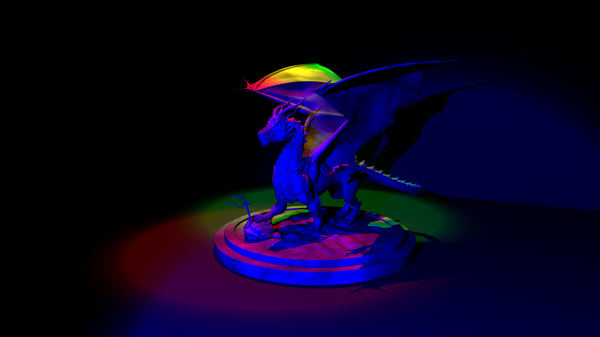

# Ray Tracing Journey

Welcome to my portfolio and technical blog documenting my journey through the **Advanced Ray Tracing** course projects. This repository showcases the step-by-step evolution of a custom ray tracer—starting from a basic intersection engine up to a full path tracer equipped with advanced acceleration structures, realistic materials, and complex lighting models.

## Project Structure & Roadmap

You can navigate through the detailed blog posts and technical reports for each assignment using the menu:

* **[HW1: Basic Ray Tracer](docs/hw1.md)** – Core parser, geometric ray-object intersections (spheres, planes, triangles), and basic local illumination shading (Ambient, Diffuse, Specular).
* **[HW2: BVH & Transformations](docs/hw2.md)** – Implementation of Bounding Volume Hierarchy (BVH) acceleration structures for massive speedups, geometric transformations, and animation rendering.
* **[HW3: Multi-Sampling & Distribution Effects](docs/hw3.md)** – Anti-aliasing via jittered multi-sampling, Depth of Field (DoF), soft shadows using area lights, motion blur, and glossy reflections.
* **[HW4: Textures & Procedural Noise](docs/hw4.md)** – Texture mapping (nearest and bilinear interpolation), normal mapping, bump mapping, and Perlin noise-based procedural texturing.
* **[HW5: Tone-Mapping & Light Types](docs/hw5.md)** – High Dynamic Range (HDR) handling via Photographic, ACES, and Filmic tone-mapping operators, alongside directional, spot, and environment lights.
* **[HW6: BRDFs & Path Tracing](docs/hw6.md)** – Implementation of various BRDF models (Phong, Blinn-Phong, Torrance-Sparrow), light objects, and uniform random sampling path tracing.
* **[Acceleration Structures Comparison](docs/project.md)** – Performance analysis comparing Uniform Grids, KD-Trees (with spatial median, object median, and SAH splitting), and BVH trees.

---
*Feel free to explore the individual homework directories for source code and implementation details.*
