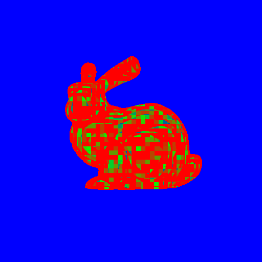
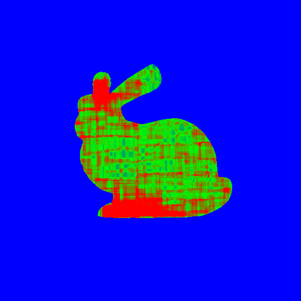
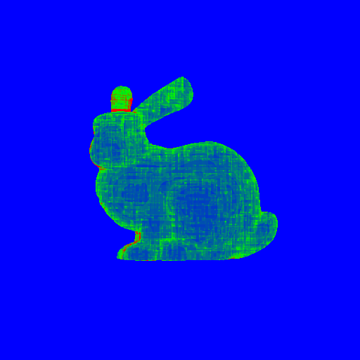
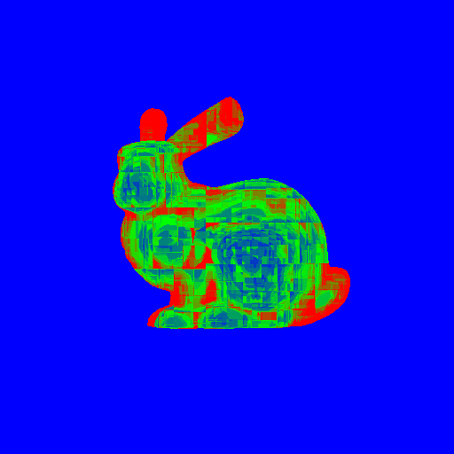
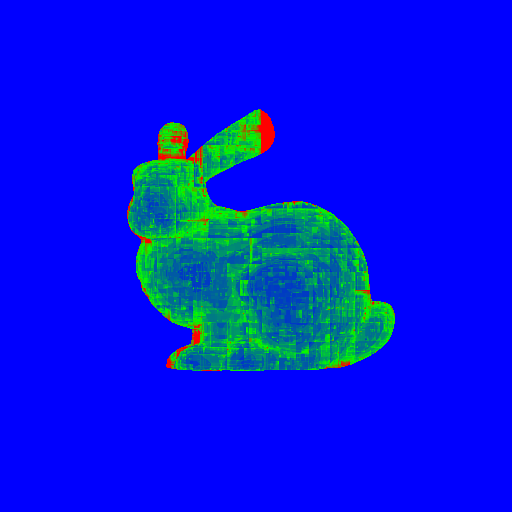

# Project: Acceleration Structures Comparison

Hello everyone, welcome to my blog again. In this blog we will compare 3 different acceleration structures which are Uniform Grid, KD-Tree, and BVH tree (I have planned to implement also the Non-Uniform Grid but due to limited time I couldn’t find time to implement it). Also we will inspect and compare different types of splitting methods. Finally I have generated a heat map of the intersections to visualize which algorithm is more efficient. Also in these heat maps it is possible to see the objects axis aligned bounding boxes (AABB).

## 1. Uniform Grid Structure

In uniform grid structure we divide the scene into uniform voxels and we intersect our ray with these voxels. In default case we are looping through all the objects in the scene. Instead of doing that we check the intersected voxel whether there was an object inside it or not. If there are, we loop through these objects to test our ray is intersecting with an object or not.

To build this grid structure I used these to structs:

```cpp
enum class TYPE {
    Triangle,
    Sphere,
    Mesh,
    MeshInstance,
    LightSphere,
    LightMesh
};
struct gObject {
    int id = -1;
    int mesh_id = -1;
    TYPE obj_type;
    Vec3r aabb_min {  FLT_MAX,  FLT_MAX,  FLT_MAX };
    Vec3r aabb_max { -FLT_MAX, -FLT_MAX, -FLT_MAX };
};
struct uGrid {
    Vec3r aabb_min {  FLT_MAX,  FLT_MAX,  FLT_MAX };
    Vec3r aabb_max { -FLT_MAX, -FLT_MAX, -FLT_MAX };
    std::vector<gObject> objects;
};
```

uGrid stores the scene’s AABB of the grid and the objects that are inside that grid. On the other hand gObject stores the objects’ type, id, mesh_id and AABB. With the help of this structure implementation becomes handy.
I have used this formulation to decide the number of cells:

```cpp
if (scene_size.x <= 0) scene_size.x = 0.0001;
if (scene_size.y <= 0) scene_size.y = 0.0001;
if (scene_size.z <= 0) scene_size.z = 0.0001;
float lambda = 5.0f; 
float volume = scene_size.x * scene_size.y * scene_size.z;
float factor = std::pow((lambda * num_objects) / volume, 1.0f / 3.0f);
nx = static_cast<int>(std::floor(scene_size.x * factor));
ny = static_cast<int>(std::floor(scene_size.y * factor));
nz = static_cast<int>(std::floor(scene_size.z * factor));
if (nx < 1) nx = 1;
if (ny < 1) ny = 1;
if (nz < 1) nz = 1;
cell_size.x = scene_size.x / nx;
cell_size.y = scene_size.y / ny;
cell_size.z = scene_size.z / nz;
```

And we assigned the objects to the grids that are encapsulated the object with this algorithm:

```cpp
int i_min = static_cast<int>((obj.aabb_min.x - main_grid.aabb_min.x) / cell_size.x);
int j_min = static_cast<int>((obj.aabb_min.y - main_grid.aabb_min.y) / cell_size.y);
int k_min = static_cast<int>((obj.aabb_min.z - main_grid.aabb_min.z) / cell_size.z);
int i_max = static_cast<int>((obj.aabb_max.x - main_grid.aabb_min.x) / cell_size.x);
int j_max = static_cast<int>((obj.aabb_max.y - main_grid.aabb_min.y) / cell_size.y);
int k_max = static_cast<int>((obj.aabb_max.z - main_grid.aabb_min.z) / cell_size.z);
for (int k = k_min; k <= k_max; ++k) {
    for (int j = j_min; j <= j_max; ++j) {
        for (int i = i_min; i <= i_max; ++i) {
            int cell_index = i + (j * nx) + (k * nx * ny);
            grid_lst[cell_index].push_back(grid_idx);
        }
    }
}
grid_idx++;
```

Now we need to implement an algorithm to find the closest hit. We first intersect the ray with the scene’s aabb. And store the entering and exiting distance to find the intersection points on the aabb.
Here is the definition and the implementation of the code:

```cpp
// Slab Method (Wikipedia definition)
/*
 * In computer graphics, the slab method is an algorithm used to 
 * solve the ray-box intersection problem in case of an axis-aligned
 * bounding box (AABB), i.e. to determine the intersection points 
 * between a ray and the box. Due to its efficient nature, that can 
 * allow for a branch-free implementation, it is widely used in computer 
 * graphics applications.
 */
bool UniformGrid::intersectAABB(Ray& ray, real& t_enter, real& t_exit) {
    real tmin = -std::numeric_limits<real>::infinity();
    real tmax = std::numeric_limits<real>::infinity();
    real epsilon = 1e-6;
    for (int i = 0; i < 3; ++i) {
        if (std::abs(ray.direction[i]) < epsilon) {
            if (ray.start_point[i] < main_grid.aabb_min[i] || 
                ray.start_point[i] > main_grid.aabb_max[i]) {
                return false;
            }
            continue;
        }
        real invD = 1.0f / ray.direction[i];
        real t0 = (main_grid.aabb_min[i] - ray.start_point[i]) * invD;
        real t1 = (main_grid.aabb_max[i] - ray.start_point[i]) * invD;
        if (t0 > t1) std::swap(t0, t1);
        tmin = (t0 > tmin) ? t0 : tmin;
        tmax = (t1 < tmax) ? t1 : tmax;
        if (tmax < tmin) {
            return false;
        }
    }
    t_enter = tmin;
    t_exit = tmax;
    return true;
}
```

And after computing the intersection point we can find the cell index like this:

```cpp
Vec3r p = ray.start_point + t_enter * ray.direction;
int x = clamp(static_cast<int>((p.x - main_grid.aabb_min.x) / cell_size.x), 0, grid.getNX() - 1);
int y = clamp(static_cast<int>((p.y - main_grid.aabb_min.y) / cell_size.y), 0, grid.getNY() - 1);
int z = clamp(static_cast<int>((p.z - main_grid.aabb_min.z) / cell_size.z), 0, grid.getNZ() - 1);
int cell_index = x + (y * grid.getNX()) + (z * grid.getNX() * grid.getNY());

```

And loop through the objects that are inside the grid. If there is no intersection then repeat this algorithm for the next grid in the direction of the ray.

## 2. KD-Tree
For the KD-Tree again I have used a similar structure with the uniform grid in order to decrease the code repetition in the main ray-tracing loop’s intersection part. 
Here is the structs that I have used:

```cpp
struct KDPrimitive {
    TYPE type;
    int id;        
    int mesh_id;   
};
struct KDNode {
    int split_axis = -1; 
    real split_pos = 0;
    
    int left_child = -1; 
    int right_child = -1;
    std::vector<KDPrimitive> primitives; 
};
```

KDPrimitive only stores the type, id and mesh id and the KDNode stores the, split axis and position which splits this node, indices of the left and right child, and if it is a leaf it stores the primitives that are inside.
For splitting I have implemented 3 different methods.

First one is spatial median splitting. In this method we choose the axis which has the biggest size and directly split from the middle of it, and assign the primitives to either side or if the primitive is on the split axis assign both sides.

Second one is object median splitting. Which decides the split axis same with the spatial splitting. Then find the split line by finding the nth element by position in that split axis and split from there.

```cpp
Vec3r extent = node_max - node_min;
best_axis = 0;
if (extent.y > extent.x) best_axis = 1;
if (extent.z > extent[best_axis]) best_axis = 2;
if (method == SplitMethod::SpatialMedian) {
    best_pos = (node_min[best_axis] + node_max[best_axis]) * 0.5f;
} 
else if (method == SplitMethod::ObjectMedian) {
    best_pos = findObjectMedian(objects, best_axis);
}
```

The third one is the Surface Area Heuristic (SAH). Instead of arbitrarily splitting in the middle, this method calculates a specific cost to find the most efficient split. We divide each axis into a fixed number of “bins” (buckets) and group the primitives into them. We then sweep through these bins, calculating the surface area and object count for the left and right sides at each step. The split position that produces the lowest cost is chosen as the winner.

```cpp
int best_axis = -1;
real best_pos = 0;
real root_area = surfaceArea(node_min, node_max);
real leaf_cost = K_INTERSECT * objects.size() * root_area;
real best_cost = leaf_cost;
if (method == SplitMethod::SAH) {
    for (int axis = 0; axis < 3; ++axis) {
        if (node_max[axis] - node_min[axis] < 1e-4f) continue;
        const int BINS = 8; 
        int bin_counts[BINS] = {0};
        real axis_width = node_max[axis] - node_min[axis];
        real scale = BINS / axis_width;
        for (auto& obj : objects) {
            int binIdx = (int)((obj.center[axis] - node_min[axis]) * scale);
            if (binIdx < 0) binIdx = 0;
            if (binIdx >= BINS) binIdx = BINS - 1;
            bin_counts[binIdx]++;
        }
        int countL = 0;
        
        for (int i = 0; i < BINS - 1; ++i) {
            countL += bin_counts[i];
            int countR = objects.size() - countL;
            
            if (countL == 0 || countR == 0) continue;
            real current_split_pos = node_min[axis] + (i + 1) * axis_width / BINS;
            Vec3r left_dim = node_max - node_min;
            left_dim[axis] = current_split_pos - node_min[axis];
            real areaL = 2.0f * (left_dim.x * left_dim.y + left_dim.y * left_dim.z + left_dim.z * left_dim.x);
            Vec3r right_dim = node_max - node_min;
            right_dim[axis] = node_max[axis] - current_split_pos;
            real areaR = 2.0f * (right_dim.x * right_dim.y + right_dim.y * right_dim.z + right_dim.z * right_dim.x);
            real split_cost = K_TRAVERSAL * root_area + K_INTERSECT * (areaL * countL + areaR * countR);
            if (split_cost < best_cost) {
                best_cost = split_cost;
                best_axis = axis;
                best_pos = current_split_pos;
            }
        }
    }
}
```

Between these methods we are expecting that the first method has the fastest build time and the slowest render time. And the third method has the slowest build time and fastest render time. But the reality is different than my expectation. The first method is dominated other 2 in both areas. And I think the reason behind this is my implementation is not correct but here are the results of comparison of these methods:

* Build time comparison:

| Scene | Spatial Median | Object Median | SAH |
| :--- | :---: | :---: | :---: |
| bunny <br> (5k tris) | 0.023s | 0.064s | 0.047s |
| chineese_dragon <br> (800k tris) | 0.489s | 2.458s | 1.457s |
| other_dragon <br> (1.85m tris) | 0.612s | 3.617s | 0.601s |

* Render time comparison:

| Scene | Spatial Median | Object Median | SAH |
| :--- | :---: | :---: | :---: |
| bunny <br> (5k tris) | 0.028s | 0.079s | 0.062s |
| chineese_dragon <br> (800k tris) | 0.093s | 0.538s | 0.710s |
| other_dragon <br> (1.85m tris) | 0.531s | 3.156s | - |

As one can observe that clear winner of my implementation is surprisingly spatial median for these test scenes. But again I want to repeat that this result should not be like this and also can be change scene to scene.

For the intersection part again we firs intersect our ray with the scene’s aabb. Then we select the child which will be traversed by computing the distance between the node split position and ray start position. Then comparing this value with the enter and exit distances to decide. Here is the code for this:

```cpp
int axis = node.split_axis;
real dist = (node.split_pos - ray.start_point[axis]) / ray.direction[axis];
int near_child = (ray.direction[axis] >= 0) ? node.left_child : node.right_child;
int far_child  = (ray.direction[axis] >= 0) ? node.right_child : node.left_child;
if (dist >= t1) { 
    traverse(near_child, t0, t1);
}
else if (dist <= t0) {
    traverse(far_child, t0, t1);
}
else {
    traverse(near_child, t0, dist);
    if (hit_record.t >= dist) {
        traverse(far_child, dist, t1);
    }
}
```

## 3. BVH-Tree

The difference between the BVH and KD-Tree is in BVH the aabb are intersecting with each other so that every object is assigned the one side of the tree. However in KD-Tree as I mentioned before objects can be in the both side of the tree when the split axis is pass through that object. I will not go into details of my BVH implementation because in the second blog I explained it. One can read it from [HW2: BVH & Transformations](hw2.md)

## 4. Performance Comparisons

Since we have implemented all of our acceleration structure now it is time to compare them. I want to first start with comparison of the build times.

* Build time comparison:

| Scene | Uniform Grid | KD-Tree | BVH-Tree |
| :--- | :---: | :---: | :---: |
| bunny <br> (5k tris) | 0.001s | 0.027s | 0.001s |
| berserker <br> (3.5k tris) | 0.001s | 0.021s | 0.001s |
| low_poly <br> (6k tris) | 0.003s | 0.014s | 0.001s |
| chineese_dragon <br> (800k tris) | 0.101s | 0.501s | 0.223s |
| other_dragon <br> (1.85m tris) | 0.150s | 0.589s | 0.494s |
| deadmau5 <br> (8k tris, 100spp) | 0.001s | 0.024s | 0.001s |
| lobster <br> (1.5m tris) | 0.129s | 0.444s | 0.505s |
| scienceTree_glass <br> (2k tris) | 0.001s | 0.003s | 0.001s |
| trex <br> (2m tris) | 0.305s | 0.980s | 0.645s |
| ton_Roosendaal <br> (80k tris) | 0.005s | 0.016s | 0.011s |

Looking at the table, you can see that the Uniform Grid is consistently the fastest to build. The KD-Tree is usually the slowest, while the BVH-Tree typically falls somewhere in the middle.

It is also clear that the size of the model matters a lot. Building the structure for a complex model like the T-Rex (with 2 million triangles) takes much longer than for a simple one like the Bunny, no matter which method you use.

Let’s look at the rendering performances of our acceleration structures for a clear view,

* Render time comparison:

| Scene | Uniform Grid | KD-Tree | BVH-Tree |
| :--- | :---: | :---: | :---: |
| bunny <br> (5k tris) | 3.173s | 0.028s | 0.028s |
| berserker <br> (3.5k tris) | 9.838s | 0.112s | 0.128s |
| low_poly <br> (6k tris) | 22.829s | 0.329s | 0.432s |
| chineese_dragon <br> (800k tris) | - | 0.092s | 0.098s |
| other_dragon <br> (1.85m tris) | - | 0.545s | 0.217s |
| deadmau5 <br> (8k tris, 100spp) | - | 31.009s | 12.225s |
| lobster <br> (1.5m tris) | - | 2.749s | 1.279s |
| scienceTree_glass <br> (2k tris) | 45.841s | 0.407s | 0.314s |
| trex <br> (2m tris) | - | 0.472s | 0.419s |
| ton_Roosendaal <br> (80k tris) | - | 1.239s | 0.250s |

When you look at the render times, the story flips completely. The Uniform Grid struggles here. It takes much longer to render even simple models and fails entirely on the complex ones like the T-Rex.

Between the two tree methods, the BVH-Tree generally performs better than the KD-Tree. You can really see this difference in the ‘deadmau5’ scene, where the BVH-Tree is more than twice as fast as the KD-Tree.

## 5. Heat Map

For generating heat map I use a very simple algorithm. If the ray intersects with a aabb of the object or node or a grid just increase it by one. If the ray intersect with the object increase it by 2 because it is complexity is more than intersecting with aabb.

Here are the visual results:

* Uniform Grid:



When we inspect this heat map one can observe that even the simplest scene has a lot of intersection cost. Almost all the objects are turned into red. So the results in the section 4 is not a surprise.   

* BVH



Compared to the other scenes we have the most green area in the BVH tree. Again the results are matched with the section 4. Also one can observe that the aabb are intersecting.
                        
* KD-Tree Spatial Median Splitting



The results are very similar to the BVH-tree but the difference is as I mentioned that the aabb’s are not overlapping.

* KD-Tree Object Median Splitting



On the paper object median splitting is more powerful method than spatial median splitting. However, my implementation is problematic probably. Because these images have more red pixels than the other one so the results in part 2 is supported by these images.

* KD-Tree SAH



Again on the paper sah is the most powerful method. But the result is not like this in my implementation. But we can inspect that almost all of the objects are divided more than the other 2 methods. Maybe if I find a more efficient way to divide it less it could be outperformance the other 2 methods.

## 6. Conclusion
To sum up, it is a really tiring process to implement and deal with the acceleration structures. Due to limited time, I couldn’t have time to make my ray tracer robust with all the features that I have implemented. Because debugging in acceleration structure is more harder than debugging the ray-tracing codes due to enormous size of objects.

Here are the things that I supposed to do but didn’t implement in my term project:

* Non-Uniform Grid Structure
* Memory Usage Comparison
* Linked-List vs Array Based Tree Implementations Performance Comparison

I hope I will implement these features in the future and share the results here. But for now, I am done with ray-tracing and get some rest. Thank you for reading my blog. Have a nice day everybody!
