# HW1: Basic Ray Tracer

Welcome to my blog! In this blog I will explain how I implemented my ray tracer homework for my Advance Ray Tracing course. Here is the list of the headers that I will mention in this blog.

## 1. Parser
In this homework the scene files are given to us with the JSON format. So, I need to parser them in order to use the data.

Here is the sample JSON format to parser:
```cpp
{
  "Scene": {
    "BackgroundColor": "0 0 0",
    "ShadowRayEpsilon": "1e-3",
    "IntersectionTestEpsilon": "1e-6",
    "Cameras": {
      "Camera": {
        "_id": "1",
        "Position": "0 0 0",
        "Gaze": "0 0 -1",
        "Up": "0 1 0",
        "NearPlane": "-1 1 -1 1",
        "NearDistance": "1",
        "ImageResolution": "800 800",
        "ImageName": "simple.png"
      }
    },
    "Lights": {
      "AmbientLight": "25 25 25",
      "PointLight": {
        "_id": "1",
        "Position": "0 0 0",
        "Intensity": "1000 1000 1000"
      }
    },
    "Materials": {
      "Material": {
        "_id": "1",
        "AmbientReflectance": "1 1 1",
        "DiffuseReflectance": "1 1 1",
        "SpecularReflectance": "1 1 1",
        "PhongExponent": "1"
      }
    },
    "VertexData": {
      "_data": "-0.5 0.5 -2 -0.5 -0.5 -2 0.5 -0.5 -2 0.5 0.5 -2 0.75 0.75 -2 1 0.75 -2 0.875 1 -2 -0.875 1 -2 0 -0.5 0",
      "_type": "xyz"
    },
    "Objects": {
      "Mesh": {
        "_id": "1",
        "Material": "1",
        "Faces": {
          "_data": "3 1 2 1 3 4",
          "_type": "triangle"
        }
      },
      "Triangle": {
        "_id": "1",
        "Material": "1",
        "Indices": "5 6 7"
      },
      "Sphere": {
        "_id": "1",
        "Material": "1",
        "Center": "8",
        "Radius": "0.3"
      },
      "Plane": {
        "_id": "1",
        "Material": "1",
        "Point": "9",
        "Normal": "0 1 0"
      }
    }
  }
}
```

To parser this file, I created my data structures like this:

```cpp
struct Camera {
    int id;
    Vec3r position;
    Vec3r gaze;
    Vec3r up;
    std::vector<real> near_plane;
    real near_distance;
    Vec2i image_resolution;
    std::string image_name;
};

struct PointLight {
    int id;
    Vec3r position;
    Vec3r intensity;
};

struct Material {
    int id;
    std::string type = "default";
    Vec3r ambient_reflectance;
    Vec3r diffuse_reflectance;
    Vec3r specular_reflectance;
    real phong_exponent;
    Vec3r mirror_reflectance = {0, 0, 0};
    real refraction_index = 0;
    real absorption_index = 0;
    Vec3r absorption_coefficient = {0, 0, 0};
};

struct Plane {
    int id;
    int point_id;
    int material_id;
    Vec3r normal;
};

struct Triangle {
    int id;
    int material_id;
    int v0_id, v1_id, v2_id;
    Vec3r normal;
    Vec3r shading_normal;
};

struct Mesh {
    int id;
    int material_id;
    std::vector<Triangle> triangles;
    std::vector<Vec3r> vertex_normals;
    std::string shading_mode = "flat";
};

struct Sphere {
    int id;
    int material_id;
    int center_vertex_id;
    real radius;
};

struct Scene {
    int max_recursion_depth = 0;
    Vec3r background_color;
    real shadow_ray_epsilon = 1e-3;
    real intersection_test_epsilon = 1e-9;
    real n_air = 1;
 
    std::vector<Camera> cameras;
    Vec3r ambient_light;
    std::vector<PointLight> point_lights;
    std::vector<Material> materials;
    std::vector<Vec3r> vertex_data;
    std::vector<Plane> planes;
    std::vector<Triangle> triangles;
    std::vector<Mesh> meshes;
    std::vector<Sphere> spheres;
};
```

Also when reading the file I use the suggested library which is https://github.com/nlohmann/json
Since the mesh data is too big to store it in JSON files, some scenes used PLY (Polygon) file format to store them. Therefore, I also need to parse this file in order to create my objects.

Here is an example of header of the PLY files:
```cpp
ply
format binary_little_endian 1.0
comment VCGLIB generated
element vertex 924422
property float x
property float y
property float z
property float nx
property float ny
property float nz
element face 1848598
property list uchar int vertex_indices
end_header
```
For reading this header given information can be found here:
https://paulbourke.net/dataformats/ply
The one thing to be careful about is the format of this file. Since this file stored in binary format, one needs to be careful about the format to read the data correctly.

Sample output of the parsed scene:
```cpp
--- Scene Parsed Successfully ---
Background Color: 0, 0, 0
Number of Vertices: 9
Number of Materials: 1
Number of Point Lights: 1
Number of Planes: 1
Number of Triangles: 1
Number of Spheres: 1
Number of Triangles in Meshes: 2
```

## 2. Ray-Object Intersection
This is the basis of the ray tracing. There are three types of objects which are plane, sphere and triangle. I will mention how to intersect a ray with them, but first I need to explain how to create our ray and image plane.

Ray struct:
```cpp
struct Ray {
    Vec3r start_point;
    Vec3r direction;
    real distance = 0;
    int depth;
    bool isIn = false;
    real n = (real)1;
};
```
For the basic ray tracing start_point, direction and depth is generally enough. However, since we are dealing with the dielectric materials I added distance (for attenuation), isIn and n (refraction index).

First I am sending this ray to every pixel of the image plane. And for every pixel, I am looping over every object to detect intersection. If there is no intersection I paint that pixel with the scene background color. If there is more than one intersection occurs, I choose the closest one and then apply shading to that point.

Here is the overall structure of my algorithm:
```cpp
Vec3r RayTracer::computeColor(Ray& ray) {
    HitRecord hit_record;
    if (ray.depth > scene.max_recursion_depth) {
        return {0, 0, 0};
    }
    if (closestHit(ray, hit_record)) {
        return applyShading(ray, hit_record);
    }
    else if (ray.depth == 0) {
        return scene.background_color;
    }
    else {
        return {0, 0, 0};
    }
}
```


I have also created a hit_record structure for holding the intersection information of the ray.

hit_record struct:
```cpp
struct HitRecord {
    real t = std::numeric_limits<real>::infinity(); 
    int material_id = -1;                          
    Vec3r intersection_point;   
    Vec3r normal; 
};
```
This hit_record will help me when applying shading because, I can store the necessary information of the intersected object and can easily use it for shading.


## 3. Shading
Shading is the one of the most important things in the ray tracing world. Because without it we cannot separate the objects by their 3D world positions. This stage makes the scene more realistic.

### 3.1 Simple Objects
For the simple objects we are only applying diffuse, ambient and specular shading to the objects. As I mentioned, applying these will have a significant impact on the realism of the scene.

```cpp
Material material = scene.materials[hit_record.material_id - 1];
final_color = final_color + material.ambient_reflectance * scene.ambient_light;
for (const auto& point_light : scene.point_lights) {
    if (!inShadow(hit_record, point_light)) {
        final_color = final_color + diffuseTerm(hit_record, point_light) + specularTerm(hit_record, point_light, ray);
    }
}
```
My basic algorithm is like as above. I am adding the ambient light to all objects once. Then, I loop over all the lights in the scene and applying diffuse and specular shading to the objects. Also when sending ray from a light, I am checking that is there any other objects between the light and the object itself. If so, the object should not be affected by that light source, so I leave that object in shadow.

Here are the some results of simple objects shading:

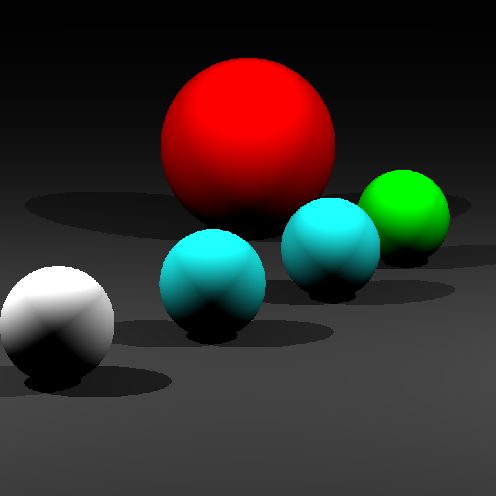

Applying only diffuse shading makes the scene 3D, but the objects have pastel colors which are not realistic.

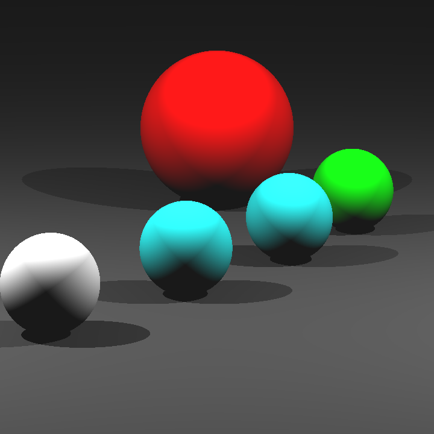

Adding ambient light to the scene gives more smooth colors to the object.

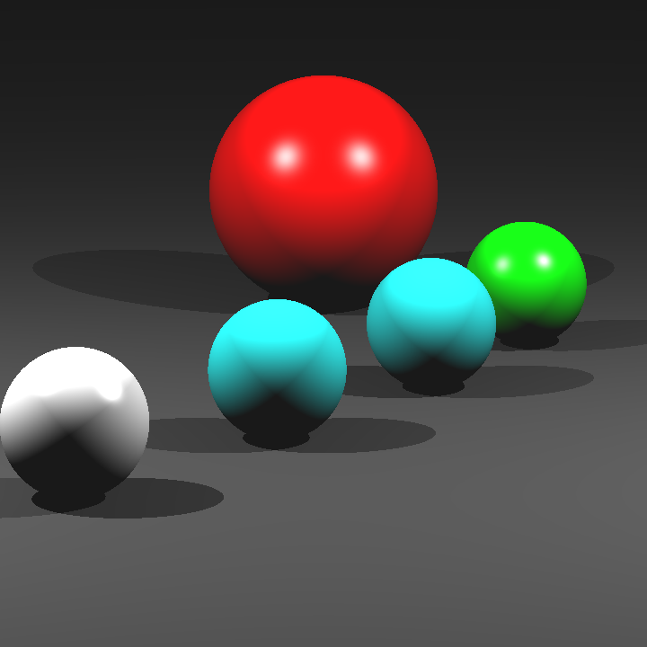

Finally adding the specular shading gives more realistic lighting. Because it the amount of the shading is depends on the position of the light. If the light is more direct to the object it gives more brightness, if the light is more on the side of the object this brightness is less than before. And finally we can see the impact of the lights realistically.

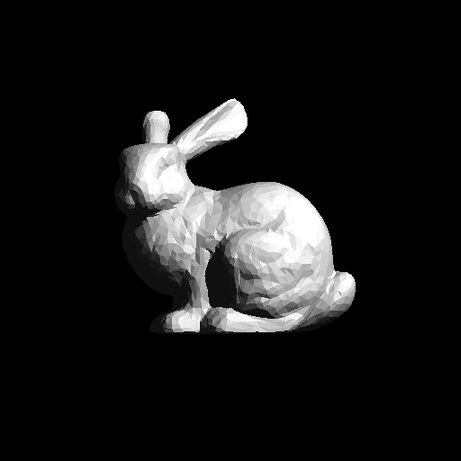

### 3.2 Mirror Objects
These types of objects are different than the simple objects because they are reflecting the rays. Adding this feature to my ray tracer is easy because when the ray hits the mirror object we are just sending another ray to the scene from that point. However, we need to limit the number of rays sent to the scene by a some constraint like max_recursion_depth in order to prevent the infinite rays.

Here is the reflection code:

```cpp
if (isMirror(material)) {
    Ray reflection_ray = reflect(ray, hit_record);
    recursive_color = recursive_color + computeColor(reflection_ray) * material.mirror_reflectance * attenuation;
}
```

The above code is in the applyShading() function. It is just sending the reflected ray to the scene.


```cpp
Ray RayTracer::reflect(Ray& ray, const HitRecord& hit_record) {
    Vec3r wo = -ray.direction;
    Vec3r normal = hit_record.normal;

    real cos_theta = dotVec3r(wo, normal);
    cos_theta = std::max((real)0, dotVec3r(wo, normal));
    
    Ray reflection_ray = ray;
    reflection_ray.direction = normalizeVec3r(-wo + 2 * normal * cos_theta);
    reflection_ray.depth += 1;
    reflection_ray.start_point = hit_record.intersection_point + normal * scene.shadow_ray_epsilon;
    
    return reflection_ray;
}
```

Sample output:


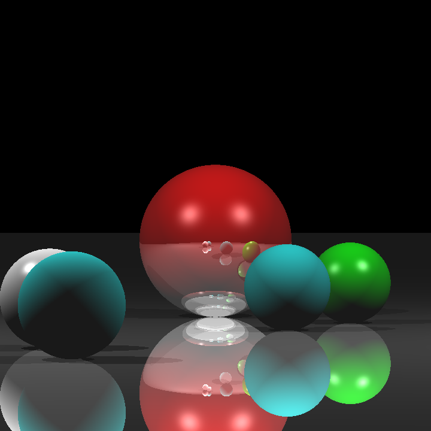

### 3.3 Conductor Objects
Conductor objects are similar to mirror objects, but they are not fully reflected the ray. Therefore, we need to compute the how much of the ray will be reflected from the surface. To do that we can use the formula of Fresnel Reflection for conductors.


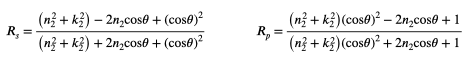  

Here is the corresponding code:
```cpp
else if (isConductor(material)) {
    real fresnel = computeFresnelConductor(ray, hit_record);
    Ray reflection_ray = reflect(ray, hit_record);
    recursive_color = recursive_color + computeColor(reflection_ray) * fresnel * material.mirror_reflectance * attenuation;
}
```

The code above is in the applyShading() function. It is computing the fresnel reflection of the ray on a conductor and send the ray to the scene by the ratio of this operation.

```cpp
real RayTracer::computeFresnelConductor(Ray& ray, const HitRecord& hit_record) {
    Material mat = scene.materials[hit_record.material_id - 1];
    real cos_theta = std::max((real)0, dotVec3r(-ray.direction, hit_record.normal));
    real n1 = ray.n;
    real n2 = mat.refraction_index;
    real k2 = mat.absorption_index;

    real a = pow(n2, 2) + pow(k2, 2);
    real b = 2 * n2 * cos_theta;
    real c = pow(cos_theta, 2);

    real Rs = (a - b + c) / (a + b + c);
    real Rp = (a * c - b + 1) / (a * c + b + 1);

    return 0.5 * (Rs + Rp);
}
```
Sample output:
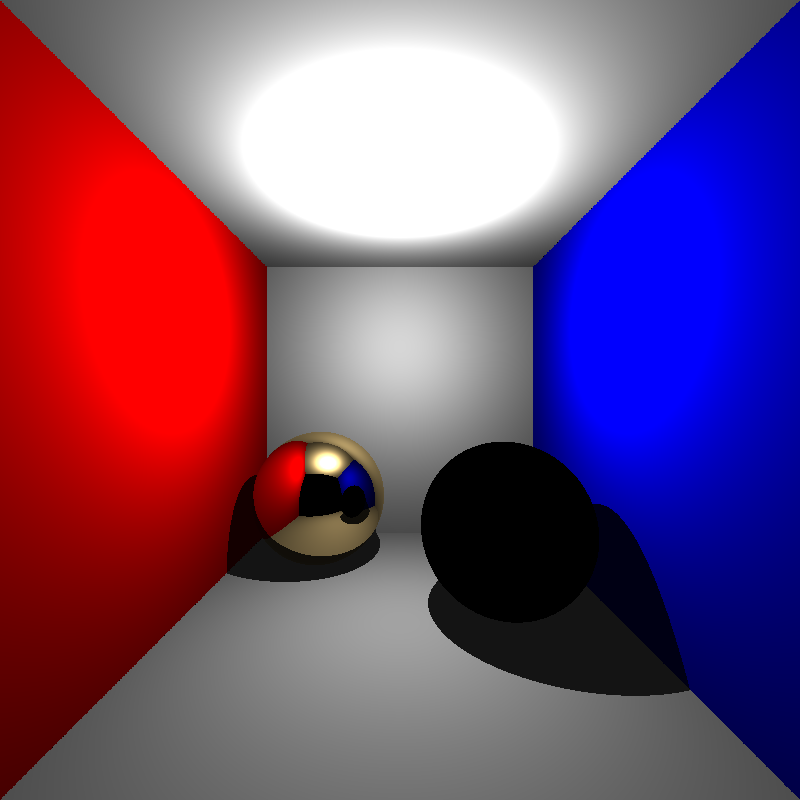  

### 3.4 Dielectric Objects
Dielectric objects are the most interesting objects among all other objects. Because these kind of objects both reflect and refract the ray when intersection happens.

There is two cases here:

* Ray is entering the object
* Ray is exiting the object

Both cases are similar, but one need to be careful when the ray is exiting because we shouldn't compute the shading at that point.

Refraction ray code:

```cpp
Ray RayTracer::refract(Ray& ray, const HitRecord& hit_record, real n1, real n2) {
    Vec3r wo = -ray.direction;
    Vec3r normal = hit_record.normal;

    real cos_theta = dotVec3r(wo, normal);
    cos_theta = std::max((real)0, dotVec3r(wo, normal));

    real eta = n1 / n2;
    real discriminant = 1 - pow(eta, 2) * (1 - pow(cos_theta, 2));
    if (discriminant > 0) {
        real cos_phi = sqrt(discriminant);

        Ray transmission_ray;
        transmission_ray.direction = normalizeVec3r((-wo + normal * cos_theta) * eta - normal * cos_phi);
        transmission_ray.depth = ray.depth + 1;
        transmission_ray.start_point = hit_record.intersection_point - normal * scene.shadow_ray_epsilon;
        transmission_ray.isIn = !ray.isIn;
        transmission_ray.n = n2;
        if (transmission_ray.isIn) transmission_ray.distance = 0;

        return transmission_ray;
    }
    return {0,0,0};
}
```

Also we need to compute the ratio of the reflection and the refraction of the ray too. This depends on the refraction_index of the object. This is again computed by the fresnel reflection of the dielectric materials.

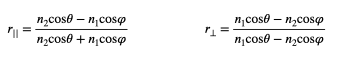  

```cpp
real RayTracer::computeFresnelDielectric(Ray& ray, const HitRecord& hit_record, real n1, real n2) {
    real cos_theta = dotVec3r(-ray.direction, hit_record.normal);
    if (cos_theta < 0) {
        cos_theta = -cos_theta; 
    }

    real eta = n1 / n2;
    real discriminant = 1 - pow(eta, 2) * (1 - pow(cos_theta, 2));
    real cos_phi;
    if (discriminant > 0) {
        real cos_phi = sqrt(discriminant);

        real r_parallel = (n2 * cos_theta - n1 * cos_phi) / (n2 * cos_theta + n1 * cos_phi);
        real r_perpendicular = (n1 * cos_theta - n2 * cos_phi) / (n1 * cos_theta + n2 * cos_phi);
        return 0.5f * (pow(r_parallel, 2) + pow(r_perpendicular, 2));
    }
    return (real)1;
}
```

```cpp
else if (isDielectric(material)) {
    real n1 = is_entering ? 1.0f : ray.n;
    real n2 = is_entering ? material.refraction_index : 1.0f;

    real reflection_ratio = computeFresnelDielectric(ray, hit_record, n1, n2);
    real transmission_ratio = 1 - reflection_ratio;

    Ray reflection_ray = reflect(ray, hit_record);
    Vec3r reflection_color = computeColor(reflection_ray) * reflection_ratio;
    
    Vec3r transmission_color = {0,0,0};
    if (transmission_ratio > 0) {
        Ray transmission_ray = refract(ray, hit_record, n1, n2);
        transmission_color = computeColor(transmission_ray) * transmission_ratio;
    }
    recursive_color = recursive_color + (reflection_color + transmission_color) * attenuation;
}
```

The output of the computeFresnelDielectric() is the ratio of the reflection ray. From this we can extract the ratio of the transmission ray by subtracting it from 1 as you can inspect in the code snippet.

There is a possibility that ray can only reflect. This case happens when the ray is going from high refraction index to low. So we need to take consider this case too.

Also another thing is when the ray is going in these dielectric objects it loses some of its energy. This is called attenuation. To compute that we will apply the Beer’s Law.

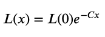  

In the above formula “C” is the absorption coefficient which is a constant, and x is the euclidean distance between the hit points inside the object.
Sample Outputs:

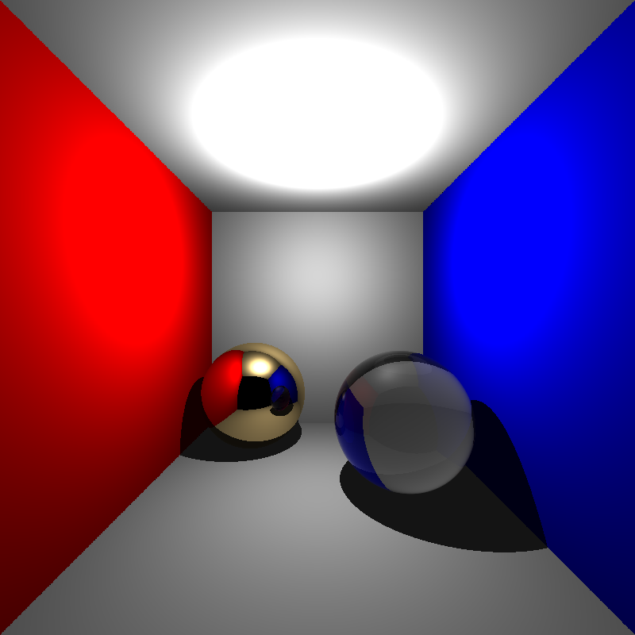  

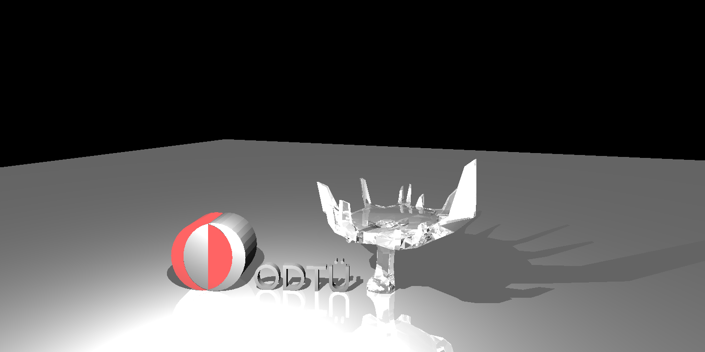  

### 3.5 Smooth Shading
For now, the all the outputs that I shared I used flat shading. However in some scenes we need to apply smooth shading. Flat shading is done by computing the face normals. On the other hand, smooth shading is done by taking the weighted average (weights are given by the shared triangle areas) of the per vertex normals. In some scenes smooth shading normals are given, but for some scenes we need to compute them by ourselves.

Here is the code for it:

```cpp
void Parser::computeVertexNormals(const std::vector<Vec3r>& vertices,
                                  const std::vector<Triangle>& triangles,
                                  std::vector<Vec3r>& outNormals)
{
    outNormals.assign(vertices.size(), {0, 0, 0});

    for (const auto& tri : triangles) {
        const Vec3r& v0 = vertices[tri.v0_id - 1];
        const Vec3r& v1 = vertices[tri.v1_id - 1];
        const Vec3r& v2 = vertices[tri.v2_id - 1];

        Vec3r faceNormal = crossVec3r(v1 - v0, v2 - v0);

        outNormals[tri.v0_id - 1] = outNormals[tri.v0_id - 1] + faceNormal;
        outNormals[tri.v1_id - 1] = outNormals[tri.v1_id - 1] + faceNormal;
        outNormals[tri.v2_id - 1] = outNormals[tri.v2_id - 1] + faceNormal;
    }

    for (auto& n : outNormals)
        n = normalizeVec3r(n);
}
```

Sample Outputs:
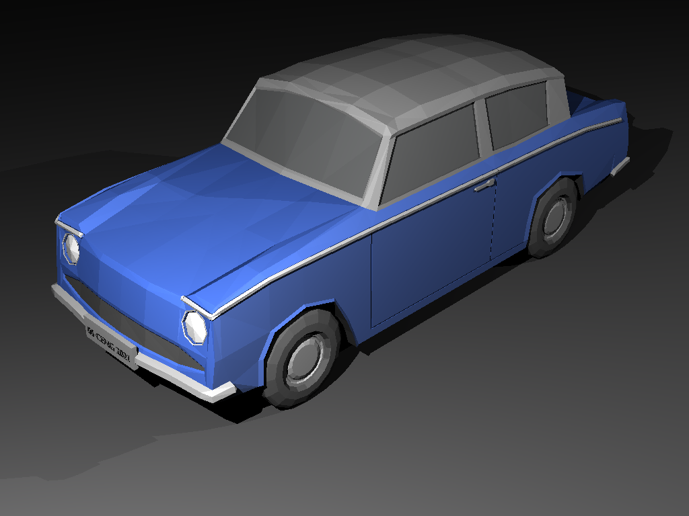  

  

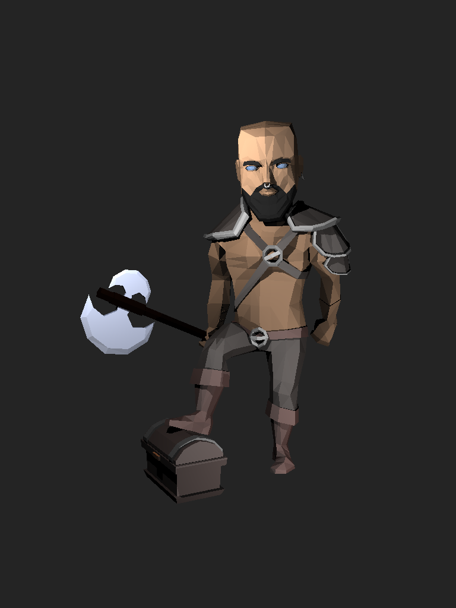

  

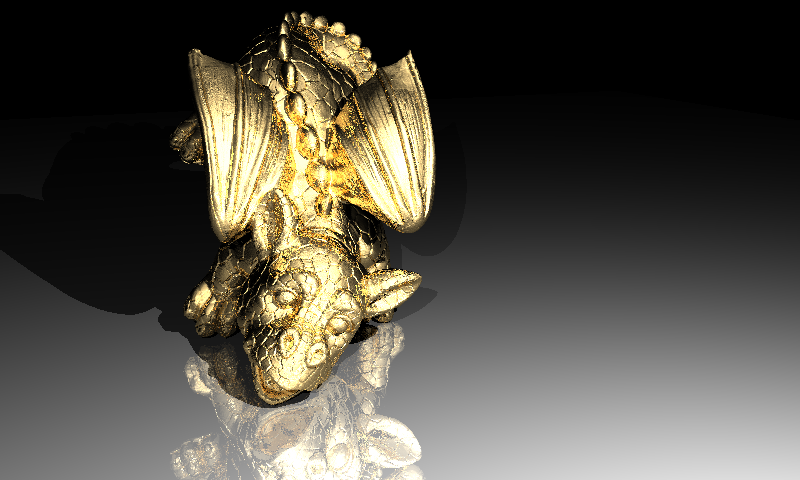  

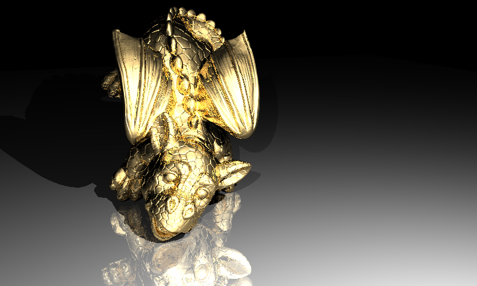

## 4. Results
Overall this homework is a very instructive for me. I have implemented a basic ray-tracer before, but I added conductors and dielectrics in this one.

Finally, I want to share the rendering time results with you. These scenes are rendered using apple m4 chip and for the compilation used -O3 flag. And the below table is comparing the rendering time results of enabling/disabling back face culling of objects.

| Back Face Culling | Disabled | Enabled |
| :--- | :---: | :---: |
| cornellbox_recursive | 0.87s | 0.78s |
| bunny | 3.01s | 1.23s |
| bunny_with_plane | 18.43s | 9.97s |
| berserker | 8.14s | 3.86s |
| science_tree_glass | 19.08s | 11.97s |
| low_poly_scene | 27.36s | 13.17s |
| david | 480.23s | 195.62s |
| chinese_dragon | - | 1298.64s |
| other_dragon | - | 5036.44s |

