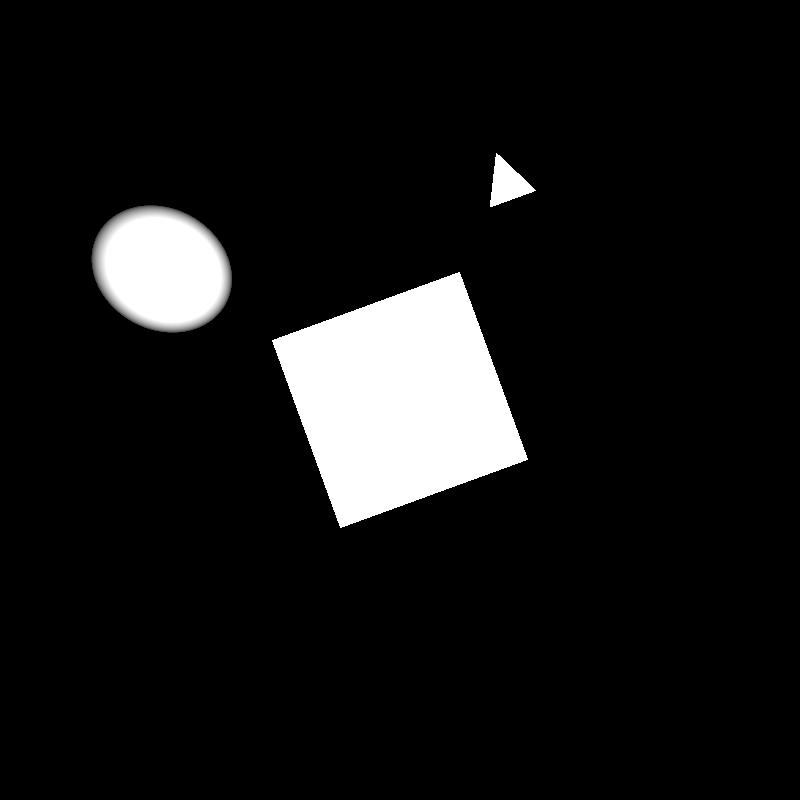
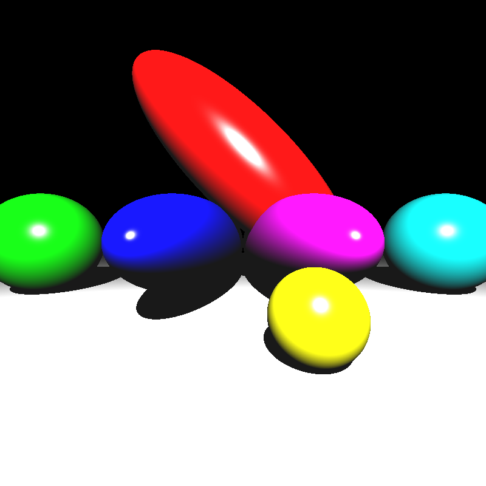
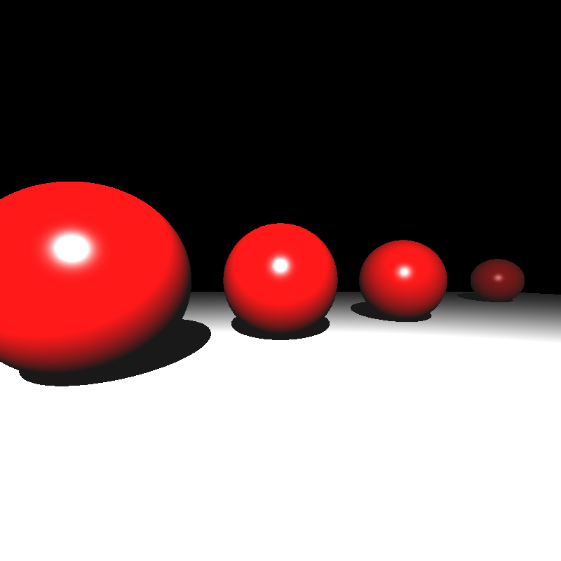
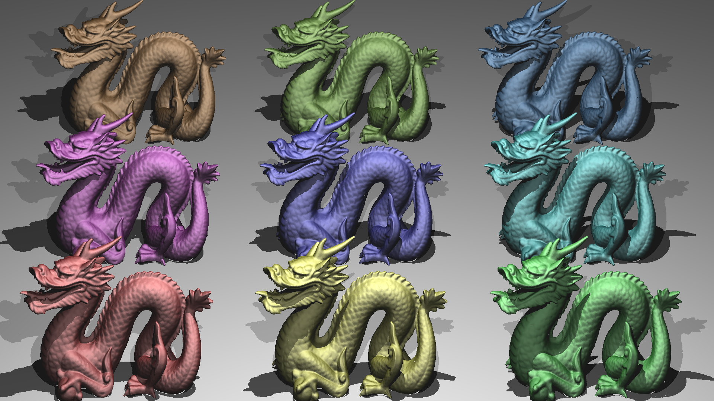
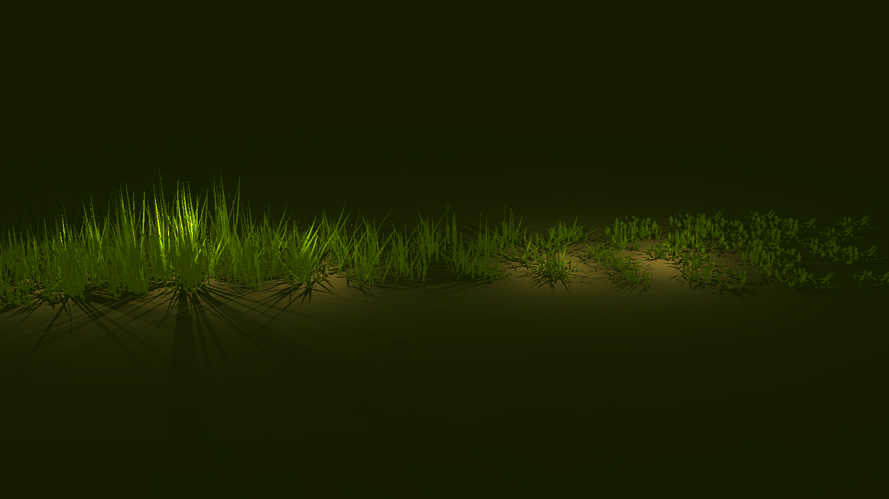
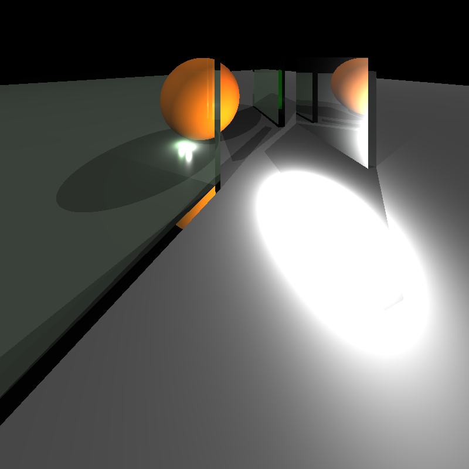
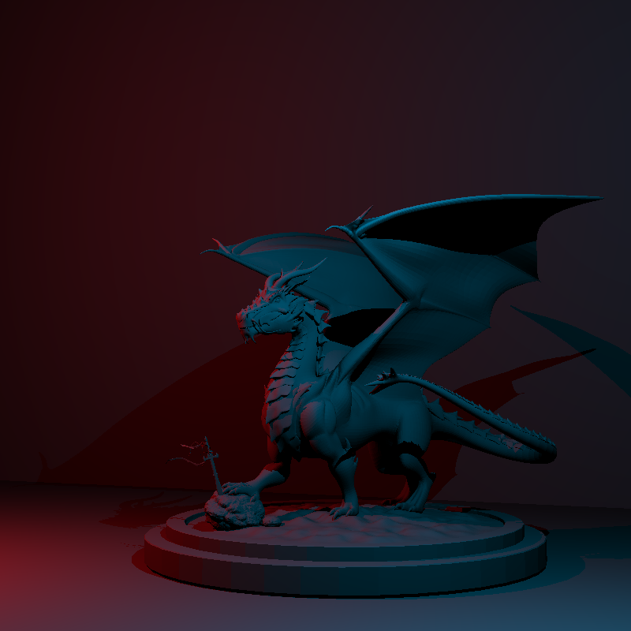
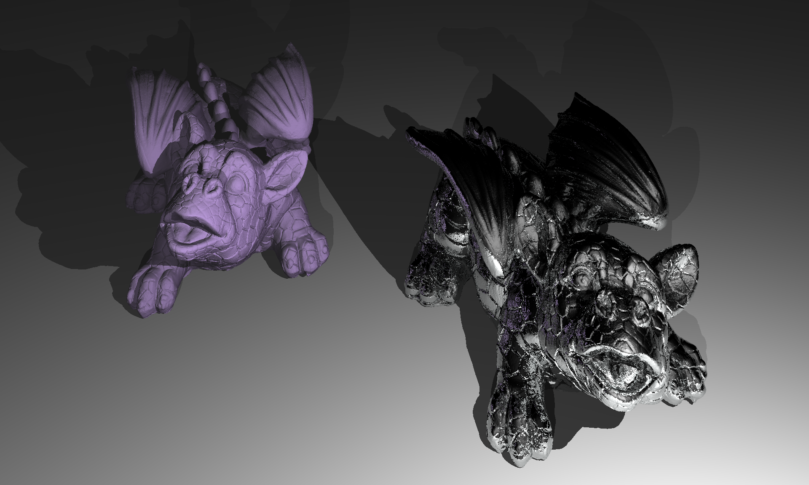

# HW2: BVH & Transformations

Welcome to my blog! Today, I will explain how I implemented the second homework of my Advance Ray Tracing course.

In the previous homework, I have implemented the basic ray tracer that can render realistic scenes. However, since I did not implement any acceleration structures, rendering time is too long. 

Here is the blog link for HW1: 
[HW1: Basic Ray Tracer](hw1.md)

So, in this homework, I have implemented an acceleration structure to overcome this problem. I choose BVH trees, because it is most commonly used one, so I want to implement it and test the results.

In addition to this, we add the transformations to our ray tracers. With the help of the transformations, we can now render animations by adding the rendered images frame by frame.

## 1. BVH
Implementing acceleration structures have a significant effect on the speed of ray tracer. BVH is a very strong acceleration structure. Here is the explanation of how I implemented it.

### 1.1 Creating BVH Tree
For the creating our BVH tree we have two options. Option one is creating a list based structure. This can be done but it consumes too much memory and it is not cache friendly. So I decided to implement the array based structure to obtain better performance.

Here is the code of my BVHNode struct:

```cpp
struct BVHNode {
    Vec3r aabb_min {  FLT_MAX,  FLT_MAX,  FLT_MAX };
    Vec3r aabb_max { -FLT_MAX, -FLT_MAX, -FLT_MAX };
    uint left_child = 0, right_child = 0;
    uint firstPrim = 0, primCount = 0;
};
```

The overall building BVH algorithm is this:

1. Find the AABB for the every object in the scene
2. Choose the axis which has the biggest difference between the min and max coordinate.
3. Choose the median element in this axis by using `std::nth_element`
4. Create new 2 AABB's for the left and the right side of the median and assign the objects as a child to the bigger AABB
5. Check whether the left and right children
6. If they have more than 10 children repeat the algorithm for this node
7. If not have more than 10 children this part of tree reaches its leaf

Here is the corresponding code:

```cpp
uint BVH::buildRecursive(uint first, uint count) {
    BVHNode node;
    Axis axis = pickSplitAxis(first, count, node);

    uint nodeIndex = nodes.size();
    nodes.push_back(node);

    if (count <= 10) {
        nodes[nodeIndex].firstPrim = first;
        nodes[nodeIndex].primCount = count;
        return nodeIndex;
    } 
    nodes[nodeIndex].primCount = 0;

    uint mid = first + count / 2;
    splitByMedian(first, count, axis);

    nodes[nodeIndex].left_child  = buildRecursive(first, count / 2);
    nodes[nodeIndex].right_child = buildRecursive(mid, count - count / 2);

    return nodeIndex;
}
```

### 1.2 Intersecting Ray with BVH
After creating our BVH structure, now it is time for the intersect our rays with the AABB’s of the BVHNodes of the trees.
* If the ray does not intersect with the node return false
* If the ray intersect with the node check the intersection with its left and right children’s AABB’s.
* If the ray intersect with the leaf node apply ray-object intersection as before with its stored primitives and return true.

Here is the corresponding recursive code:

```cpp
bool BVH::intersectNode(uint nodeIndex, Ray& r, HitRecord& rec) const {
    BVHNode node = nodes[nodeIndex];

    if (!rayAABB(r, node.aabb_min, node.aabb_max, rec.t)) {
        return false;   
    }   

    // Leaf Node
    if (node.primCount > 0) {
        bool hit = false;
        auto& tris = currentMesh->getTriangles();

        // Store the hit record
        for (uint i = 0; i < node.primCount; i++) {--}
        
        return hit;
    }

    bool hitLeft  = intersectNode(node.left_child, r, rec);
    bool hitRight = intersectNode(node.right_child, r, rec);

    return hitLeft || hitRight;
}
```

### 1.3 Speed Compression with the Previous Results
| | w.o. BVH (s) | with BVH (s) |
| :--- | :---: | :---: |
| cornellbox_recursive | 0.78 | 0.079 |
| bunny_with_plane | 9.97 | 0.137 |
| ton_Roosendaal_smooth | not-rendered | 0.259 |
| david | 195.62 | 0.294 |
| chinese_dragon | 1298.64 | 0.774 |
| other_dragon | 5036.44 | 0.808 |
| trex_smooth | not-rendered | 1.189 |
| lobster | 20000 | 1.842 |

As one can observe from this table that for the complex scene which maybe consists of more than 1 million triangles, acceleration structure has a great impact on the speed of my ray-tracer.

Also with the help of this speed boost, debugging my code becomes much easier because to see the results of the scene sometimes I have to wait more than 5 hours whether my correction is correct or not.

## 2. Transformations

### 2.1 Applying Transformations

Transformations are easy to implement compared to the acceleration structure. Because we are not transforming the whole object, we are transforming the ray itself to see that whether ray hits the transformed object or not.

To find the transformation matrices, in the parser multiplying them with each other and find the one composite transformation matrix. Then I transformed my ray like this:

```cpp
Ray RayTracer::transformRay(const Ray& ray, const Mat4r& mat) {
    glm::mat4 gmat = mat.toGlm();

    glm::vec4 o(ray.start_point.x, ray.start_point.y, ray.start_point.z, 1.0);
    glm::vec4 o_new = gmat * o;

    glm::vec4 d(ray.direction.x, ray.direction.y, ray.direction.z, 0.0);
    glm::vec4 d_new = gmat * d;

    Ray transformed;
    transformed.start_point = Vec3r(o_new.x, o_new.y, o_new.z);
    transformed.direction = normalizeVec3r(Vec3r(d_new.x, d_new.y, d_new.z));

    transformed.distance = ray.distance;
    transformed.depth = ray.depth;
    transformed.isIn = ray.isIn;
    transformed.n = ray.n;

    return transformed;
}
```
After doing this transformation I intersect my ray with the objects.

Here is the corresponding code:
```cpp
Ray localRay = transformRay(shadow_ray, mesh.getInverseTransformation());
HitRecord temp;
if (mesh.getBVH().intersect(localRay, temp)) {
    Vec3r worldHit = applyTransformToPoint(mesh.getTransformation(), temp.intersection_point);
    real t_world = euclideanDistanceVec3r(shadow_ray.start_point, worldHit);
    if (t_world < light_distance)
        return true;
}
```





Also with the help of the transformations we can generate animations by slightly transforming the meshes for each scene. Then if we merge these images we can get a cool animations like this:

<video controls autoplay muted loop width="100%">
  <source src="../assets/videos/windmill.mp4" type="video/mp4">
  Your browser does not support the video tag.
</video>

For the camera transformations we apply the transformations to its axis u, v, w. One need to be careful about that for zooming effect we should not normalize the axis after scaling because its effect is disappearing.

<video controls autoplay muted loop width="100%">
  <source src="../assets/videos/davids_camera_zoom.mp4" type="video/mp4">
  Your browser does not support the video tag.
</video>

<video controls autoplay muted loop width="100%">
  <source src="../assets/videos/davids_camera.mp4" type="video/mp4">
  Your browser does not support the video tag.
</video>

### 2.2 Instancing
Instancing is a very important concept in ray-tracing and real-time rendering. Because some scenes are consisted of an objects which are structurally same but different in case of their material properties. Without instancing we need to store the mesh data of these objects separately which is too costly. So instead of doing this we do instancing to the objects.

In our scenes we stored them as a different than meshes like this:
```cpp
"MeshInstance": [
  {
    "_id": "3",
    "_baseMeshId": "2",
    "Material": "3",
    "Transformations": "t2"
  },
```
We apply the given transformations on a mesh or meshInstance with the given baseMeshId.

```cpp
for (auto& mi : myScene.mesh_instances) {
    mi.transformation = computeInstanceTransformRecursive(mi, myScene);
    mi.inv_transformation = mi.transformation.inverse();

    int meshID = getMeshByID(myScene, mi.baseMeshObjectId);
    Mesh& baseMesh = myScene.meshes[meshID];
    const BVHNode& node = baseMesh.getBVH().getBVHNodes()[0];

    computeWorldAABB(node.aabb_min, node.aabb_max, mi.transformation,mi.aabb_min_world, mi.aabb_max_world);
}
```

After finding the correct composite matrix for the mesh instances we compute a new AABB for that mesh instance by transforming the original AABB to create a top level acceleration structure. However I did not implement it because I do not have enough time for adjusting my code for this.

For the ray-meshInstance intersection part it is same as the ray-mesh intersection because we are intersecting the transformed ray with the baseMesh.

```cpp
Ray localRay = transformRay(shadow_ray, inst.inv_transformation);
HitRecord temp;
int id = getMeshByID(scene, inst.baseMeshObjectId);
Mesh& baseMesh = scene.meshes[id];

if (baseMesh.getBVH().intersect(localRay, temp)) {
    Vec3r worldHit = applyTransformToPoint(inst.transformation, temp.intersection_point);
    real t_world = euclideanDistanceVec3r(shadow_ray.start_point, worldHit);
    if (t_world < light_distance)
        return true;
}
```







## 3. Results
Overall, it is a fun project to do it. Implementing a data structure which I wanted to implement it for a long time is a great experience for me. With the effects of the transformations now my ray tracer not only render scenes but can generate animations too.

Here are the some speed results of my ray-tracer:

| Scene | Parsing + Build BVH (s) | Ray-Tracing (s) |
| :--- | :---: | :---: |
| simple_transform | 0.0002 | 0.041 |
| ellipsoids | 0.0003 | 0.056 |
| mirror_room | 0.0003 | 0.291 |
| metal_glass_plates | 0.001 | 0.244 |
| two_berserkers | 0.004 | 0.145 |
| marching_dragons | 0.357 | 0.867 |
| dragon_metal | 0.792 | 1.487 |
| grass_desert | 0.005 | 6.984 |








