# HW3: Multi-Sampling & DoF

<video controls autoplay muted loop width="100%">
  <source src="../assets/videos/tap_water.mp4" type="video/mp4">
  Your browser does not support the video tag.
</video>

Welcome to my blog! Today’s topic is again ray tracing. So far our ray tracer can now render scenes faster with the help of the data structures. Also, we have added the transformations to our scenes so that we can now render animations.

However, we have a huge problem in our ray tracer. Since we are sending all the rays through the center of the every pixel. It is possible that our rays can miss the object. Also, the edges of the objects in the scene seems like discrete.

Here is the example of this problem:

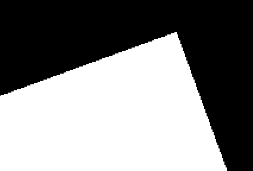

In this blog we will try to solve this problem and implement distribution ray tracing features.

## 1. Multi-Sampling

Implementing multi-sampling is very easy compared to the other ones. We will send multi-rays to our pixel instead of one. There are more than one ways of doing this.

I choose the jittered sampling because its results are better compared to the random sampling. In random sampling all the samples can be collected in some point on the pixel. This can cause anti-aliasing and other problems. In jittered sampling pixels are divided into equal multi-cells. And each cell has its own random parameter. So that we can distribute rays uniformly at random.

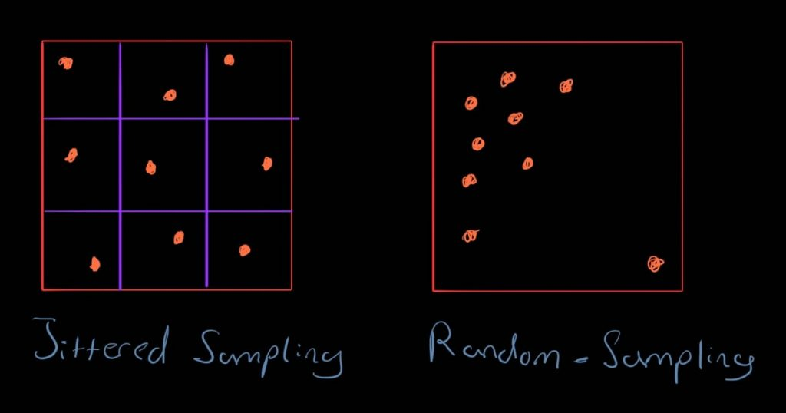

Here is the corresponding code for random number generation:

```cpp
std::vector<Vec2r> pixel_samples(total_samples);
std::mt19937 gRandomGenerator(0);
std::uniform_real_distribution<> rnd(0, 1);
int i = 0;
for (int y = 0; y < sample_length; ++y) {
    for (int x = 0; x < sample_length; ++x) {
        pixel_samples[i].x = (x +   rnd(gRandomGenerator)) / sample_length;
        pixel_samples[i].y = (y + rnd(gRandomGenerator)) / sample_length;
```

Now our ray direction computed like this:
```cpp
real s_u = (i + samples[k].psi_1) * (r - l) / float(nx);
real s_v = (j + samples[k].psi_2) * (t - b) / float(ny);

Vec3r s = q + s_u * right - s_v * up;
Vec3r dir = normalizeVec3r(s - position);
```

Also multi-sampling helps to reduce the noise in the scene. Here is the visual example of this:


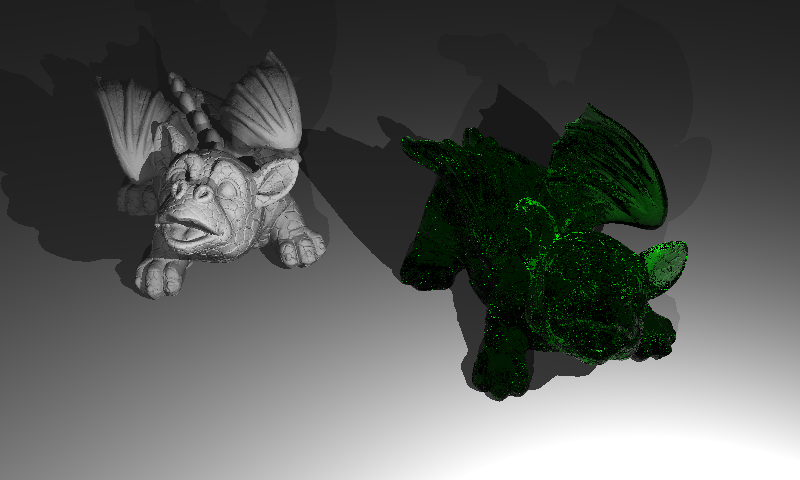

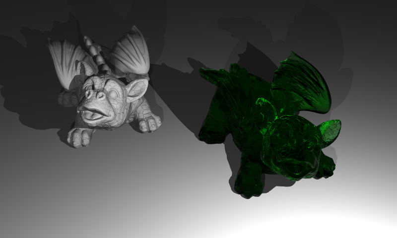

As one can observe that for the green dragon it cleans the green noise by averaging the rays. I have both used box and gaussian filter and I observe that results are close to each other. However, for more complex scenarios gaussian filter is better at dealing with aliasing problems.

## 2. Depth of Field
For now all the rays are focusing unique points on their directions. We can add a lens between the camera and the scene to blurring the objects that are so close or far away from the camera. Here is the visualization of this concept:

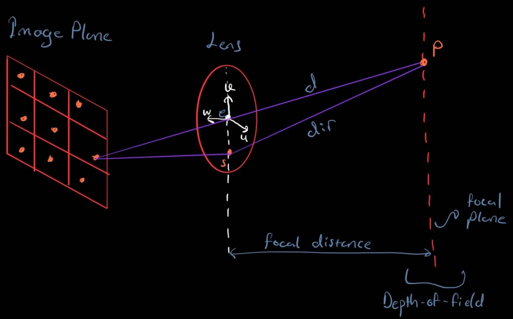

The main algorithm is this:
1. Compute “dir”
2. Compute “P”
3. Compute “d”

Here is the corresponding code:

```cpp
Vec3r dir = normalizeVec3r(s - position);

real t_fd = camera.getFocusDistance() / dotVec3r(dir, gaze);
Vec3r p = position + t_fd * dir;

ray.start_point = position + camera.getApertureSize() 
    * (right * (samples[k].psi_3 - 0.5) + up * (samples[k].psi_4 - 0.5));
ray.direction = normalizeVec3r(p - ray.start_point);
```

So the rays are going to hit the objects in the focal plane will have a sharp focus and other rays will sample from different points so the results will be blurry.

We must ensure the random samples on the image plane are independent of those on the lens. By shuffling the lens samples, we decorrelate them from the pixel samples to avoid structural artifacts.

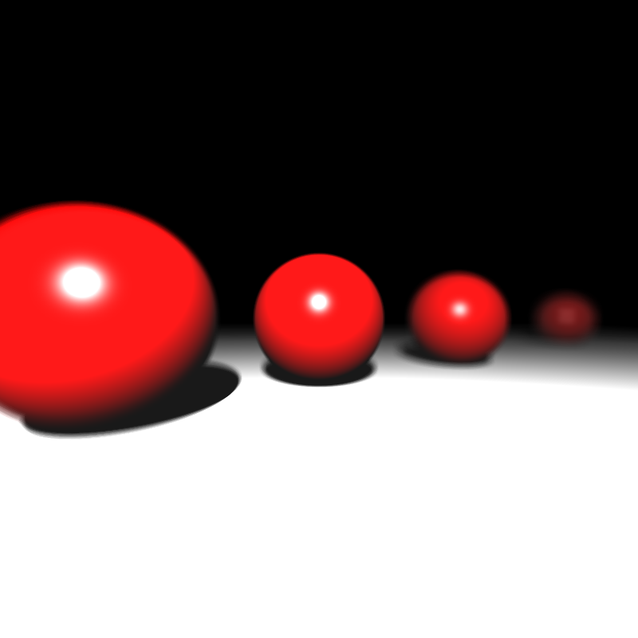

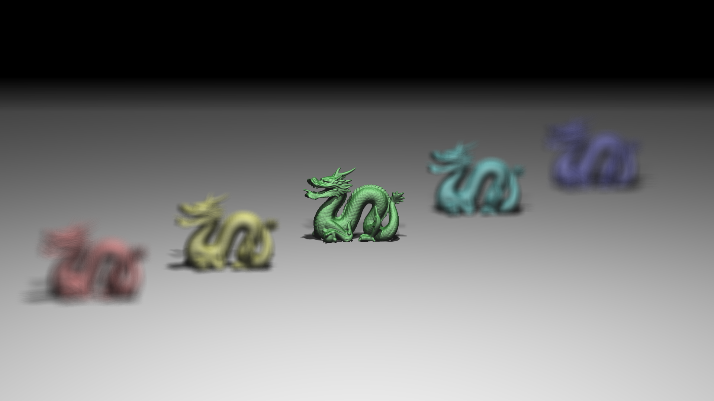

## 3. Soft Shadows
Soft shadows can be achieved by using area lights. In point lights we can take only one sample from it, so getting soft shadows is impossible. However with the help of the area light we can sample from multiple positions on them from different hit points.

Here is the structure of the area lights:
```cpp
"AreaLight": {
  "_id": "1",
  "Position": "0 9.8 2",
  "Normal": "0 -1 0",
  "Size": "3",
  "Radiance": "150000 150000 150000"
}
```
Different from point light we have a normal and size of the light. We use the normal for generating local coordinate space. Then with the help of this we can generate random points on our area light.

Local coordinates generation code:
```cpp
Vec3r u;
if (std::abs(norm.x) <= std::abs(norm.y) && std::abs(norm.x) <= std::abs(norm.z)) {
    u.x = 0;
    u.y = -norm.z;
    u.z = norm.y;
}
else if (std::abs(norm.y) <= std::abs(norm.x) && std::abs(norm.y) <= std::abs(norm.z)) {
    u.x = -norm.z;
    u.y = 0;
    u.z = norm.x;
}
else {
    u.x = -norm.y;
    u.y = norm.x;
    u.z = 0;
}

u = normalizeVec3r(u);
Vec3r v = normalizeVec3r(crossVec3r(u, norm));
```
We can get the sample positions on our area light like this:
```cpp
Vec3r point = area_light.getPosition() + 
            area_light.getSize() * 
            (u * (psi_1 - 0.5) + 
            v * (psi_2 - 0.5));
```
Here is the results:
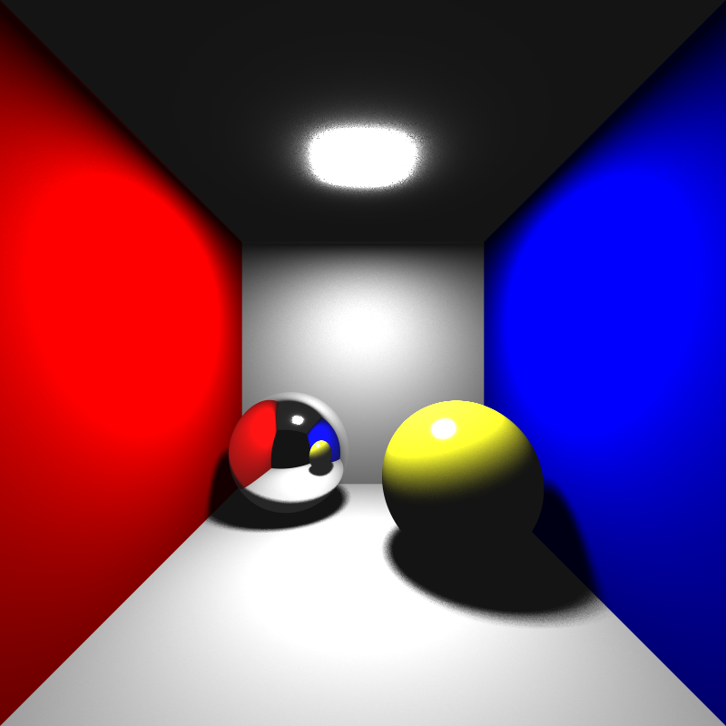

## 4. Motion Blur
For adding motion blur to our scenes we add motion vector parameter to our objects. We only apply translational motion blur. We also store a random time variable (between 0 and 1) and multiply this with the motion vector to sample from different times.

Here is the corresponding code:

```cpp
Vec3r mv = inst.motion_vector * scene.samples[curr_sample_index].psi_5;
real tx = mv.x, ty = mv.y, tz = mv.z;
Mat4r motionMatrix =  Mat4r::createTranslation(tx, ty, tz);
Mat4r transform_mat = inst.transformation;
transform_mat = motionMatrix * transform_mat;
inv_mat = transform_mat.inverse();
```
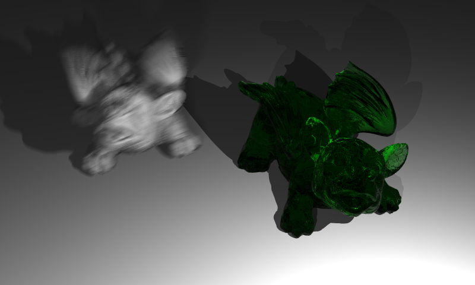

## 5. Glossy Reflections

With the help of the glossy reflections we can represent imperfect mirrors such as brushed metal etc. In this implementation we sample a randomly perturbed reflection direction using a roughness parameter. To compute the r’ (reflection direction sample) we can create an orthonormal basis around the r (original reflection direction) just like we did for the area lights.

Here is the corresponding code:

```cpp
real psi_1 = scene.samples[curr_sample_index].psi_8;
real psi_2 = scene.samples[curr_sample_index].psi_9;
reflection_ray.direction = reflection_ray.direction + 
    roughness * 
    (u * (psi_1 - 0.5) + 
    v * (psi_2 - 0.5));
```
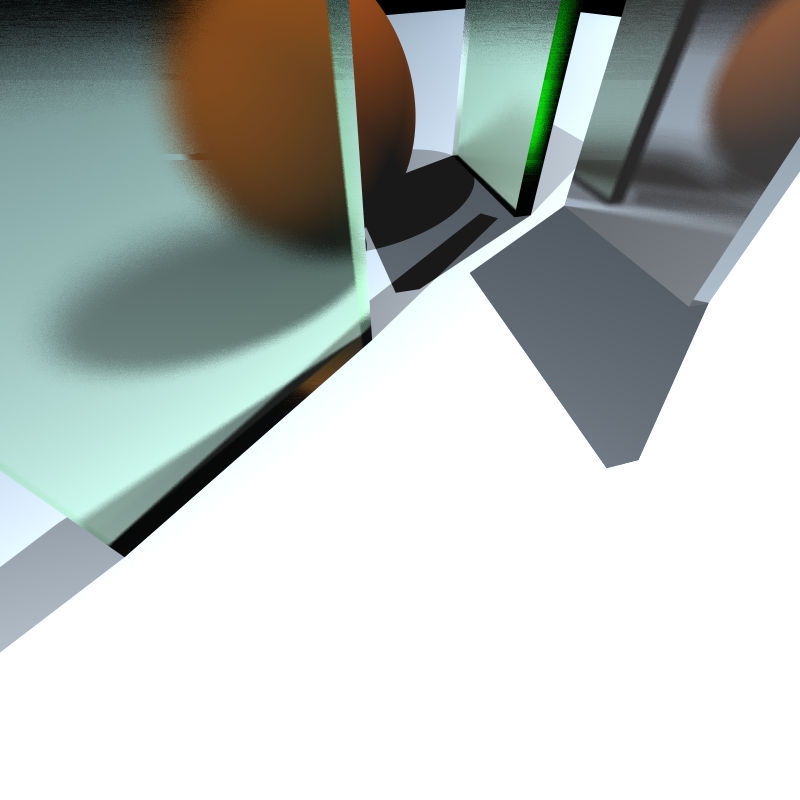

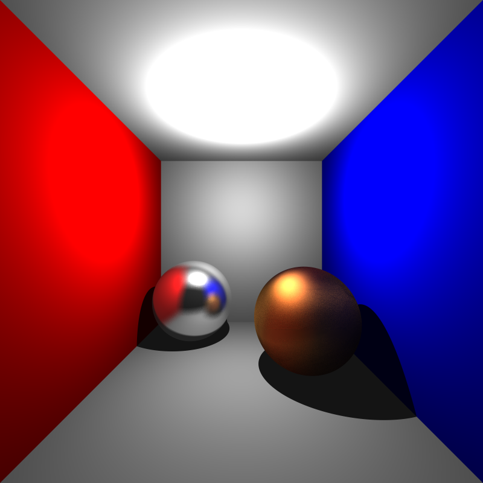

## 6. Results
Overall implementation of these features are not difficult compared to the other homework, but the results are very satisfiable and also the visual quality is improved with the help of the multi-sampling.

Here is the time measurement of the scenes:
Here is the time measurement of the scenes:

| Scene | Time(s) |
| :--- | :---: |
| spheres_dof | 3.355 |
| cornellbox_area | 5.383 |
| cornellbox_brush_metal | 19.049 |
| focusing_dragons | 24.617 |
| dragon_dynamic | 183.747 |
| chessboard_arealight | 11.255 |
| chessboard_arealight_dof | 11.864 |
| chessboard_arealight_glass_queen | 21.299 |
| deadmau5 | 12.723 |
| wine_glass | 416.701 |