# HW5: Tone Mapping & Lights

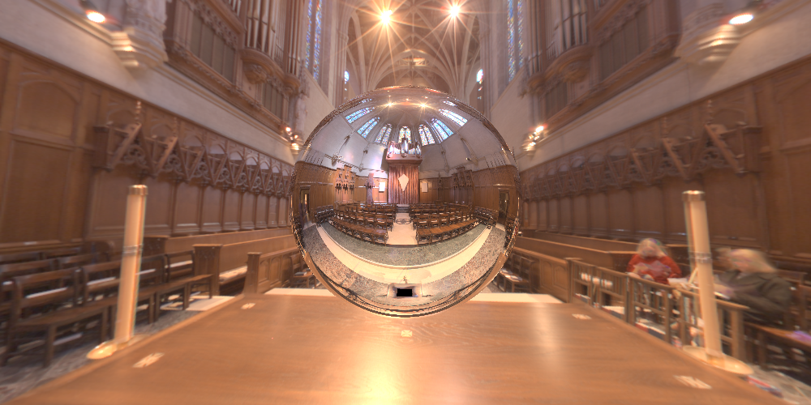

Hello everyone, welcome to my blog again. This will be the episode 5 of our ray-tracing journey. Today we will add new light types to our scenes. Also for now, we only deal with the LDR images. In this blog we also add how to deal with HDR images by applying different tone-mapping strategies.

## 1. Tone-Mapping

As I mention before, for now we only deal with LDR images. Our pixel values are between 0 and 255 and if there is a pixel value out of this range we have clipped this value into this range. This is not a best way to deal with these cases because we are losing information about the scene. Also for HDR textures the pixel values can be much bigger than the upper limit (255). To correctly handle this, we should apply tone mapping. For this blog we will talk about three different types of tone-mapping algorithms. Which are Photographic, ACES and Filmic.

### 1.1 Photographic Tone-Mapping

In general Photographic TMO consists of two stages:

*   A global operator simulating key-mapping
*   A local operator simulating dodging and burning

We start by converting our pixel values from RGB color space to XYZ color space. Then we get the Y value as our luminance. Here is the conversion formula:

```cpp
real Y = R * 0.2126 + G * 0.7152 + B * 0.0722;
```

After doing that our goal is to compute the middle gray and map it to the %18 (key value) reflectance. The middle gray is the log average of the luminance. Here is the formula and the code snippet:

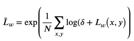

```cpp
size_t size = L_w.size();
real epsilon = 1e-4;
real L_w_prime = 0;
for (int i = 0; i < size; ++i) {
    L_w_prime += log(epsilon + L_w[i]);
}
L_w_prime = exp(L_w_prime / size);
```

Here is the formula and code snippet of mapping to the desired “zone”:

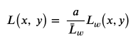

```cpp
size_t size = L_w.size();
real key_over_L_w_prime = key / L_w_prime;
for (int i = 0; i < size; ++i) {
    L.push_back(key_over_L_w_prime * L_w[i]);
}
```

After doing these steps if we compute our pixel values from luminance one can observe that these values are still much bigger than 255. So at this step we will apply sigmoidal compression to compress high luminances. Here is the formula of sigmoidal compression:

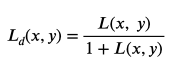

Also for artistic effects, some burn-out may may be added. Here is the formula:

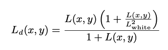

Here is the code snippet of computing L_white:

```cpp
size_t size = L.size();
std::vector<real> L_sorted = L; 
std::sort(L_sorted.begin(), L_sorted.end());
real percentile = (100 - burn_out) / 100;
if (percentile >= 0.99) {
    percentile = 0.99;
}   
real L_white = L_sorted[floor(size * percentile)];
```

After doing all these steps we have display luminance. So we should compute the display pixel values with this formula:

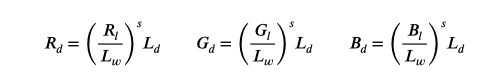

Finally we should clamped the pixel values to [0,1] range and then apply gamma correction. Here is the formula and the code snippet:

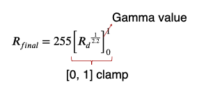

```cpp
Vec3r color;
real eps = 1e-6;

color.x = pow(R / (L_w + eps), saturation) * L_d;
color.y = pow(G / (L_w + eps), saturation) * L_d;
color.z = pow(B / (L_w + eps), saturation) * L_d;

clampVec3r(color, 0.0, 1.0);

color.x = pow(color.x, 1.0f / gamma);
color.y = pow(color.y, 1.0f / gamma);
color.z = pow(color.z, 1.0f / gamma);

color = clampVec3r(color * 255, 0, 255);
```
ACES and Filmic TMOs are similar to the photographic generally. Instead of applying sigmoidal compression we apply these formulas:

*   Filmic TMO formula
  
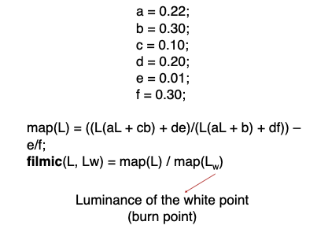

* ACES formula

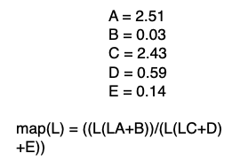

```cpp
real A = 2.51;
real B = 0.03;
real C = 2.43;
real D = 0.59;
real E = 0.14;

real a = 0.22;
real b = 0.3;
real c = 0.1;
real d = 0.2;
real e = 0.01;
real f = 0.3;

real ToneMap::mapACES(real L) {
    return ((L * (L * A + B)) / (L * (L * C + D) + E));
}

real ToneMap::mapFilmic(real L) {
    return ((L * (L * a + c * b) + d * e) / (L * (a * L + b) + d * f)) - e / f;
}

real L_d = mapFilmic(L[i]) / mapFilmic(L_white); // Filmic
real L_d = mapACES(L[i]); // ACES
```

* Filmic 

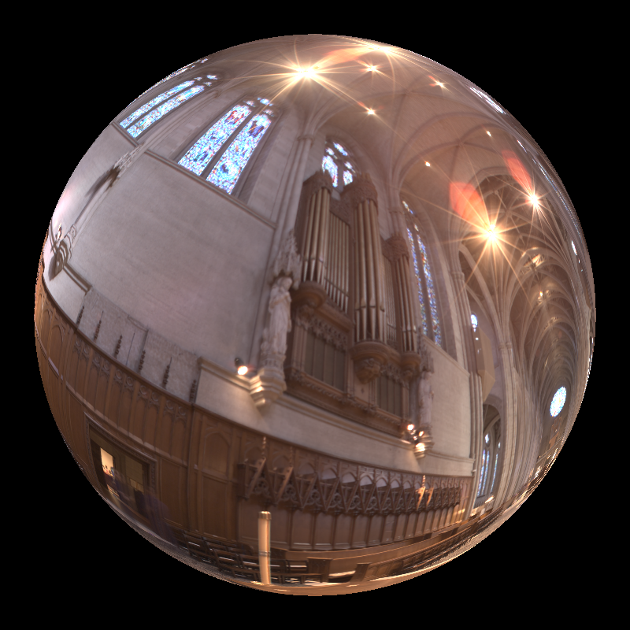

* ACES

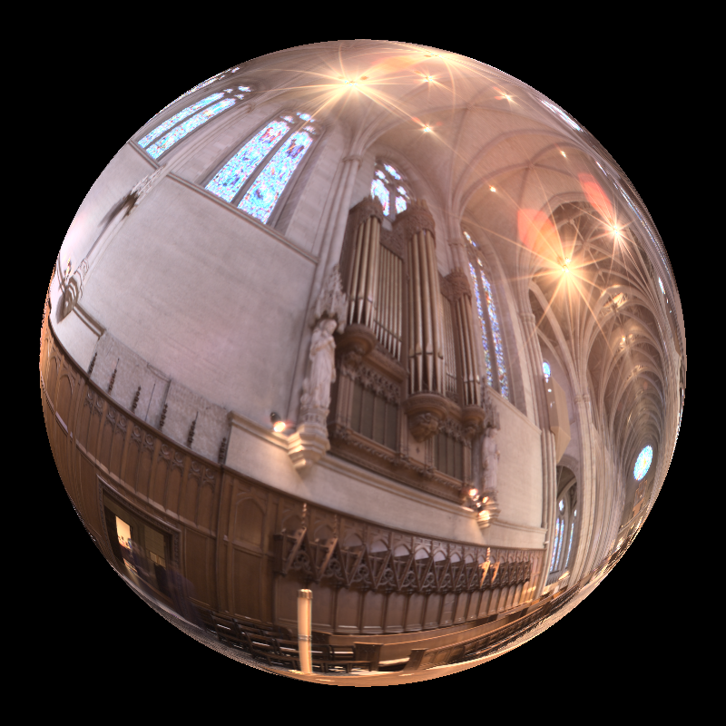

## 2. Lights
In this section we will introduce new types of lighting methods. Which are directional light, spot light and environment light.

### 2.1 Directional Light
Directional light is basically a point light that put in an infinitely far away and have some direction. So we will not do nothing special just modify the point light’s code to apply diffuse and specular shadings.

Here are the corresponding code snippets:

* Diffuse Shading Code

```cpp
Vec3r RayTracer::diffuseTermDirection(const HitRecord& hit_record, const DirectionalLight& light) {
    Material material = scene.materials[hit_record.material_id - 1];

    Vec3r light_direction = -light.getDirection();
    Vec3r wi = normalizeVec3r(light_direction);

    real cos_theta = std::max((real)0, dotVec3r(wi, hit_record.normal));
    return hit_record.kd * cos_theta * light.getRadiance();
}
```

* Specular Shading Code

```cpp
Vec3r RayTracer::specularTermDirection(const HitRecord& hit_record, const DirectionalLight& light, Ray& ray) {
    Material material = scene.materials[hit_record.material_id - 1];

    Vec3r light_direction = -light.getDirection();
    Vec3r wi = normalizeVec3r(light_direction);

    Vec3r irradiance = light.getRadiance();
    Vec3r wo = normalizeVec3r(-ray.direction);

    Vec3r h = normalizeVec3r(wi + wo);
    real cos_alpha = std::max((real)0, dotVec3r(hit_record.normal, h));

    return hit_record.ks * pow(cos_alpha, material.getPhongExponent()) * irradiance;
}
```

And here are the results:

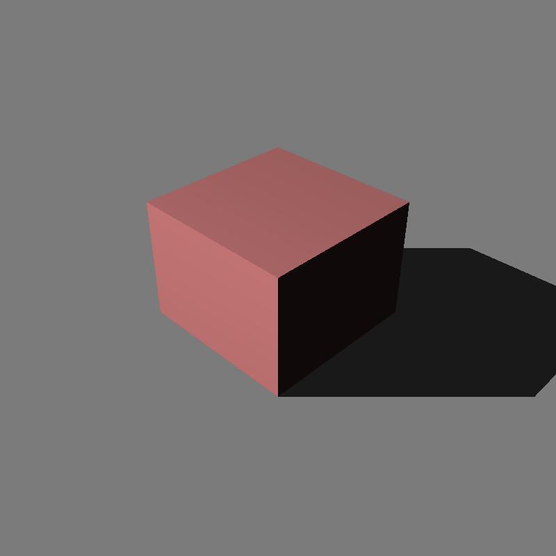


### 2.2 Spot Light
Again the spot light is very similar to the point light. However, now we define some angles and direction for the light.

Here is the illustration of the spot light:

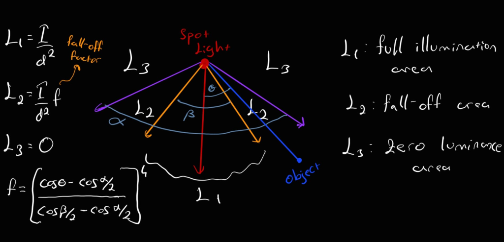

Here is the corresponding code snippet:

```cpp
real f_angle = light.getFallOffAngle() / 2;
    real c_angle = light.getCoverageAngle() / 2;

    real fall_off_factor = 1;
    if (angle > f_angle) {
        fall_off_factor = pow((cos(toRadians(angle)) - cos(toRadians(c_angle))) / 
                          (cos(toRadians(f_angle)) - cos(toRadians(c_angle))), 4);
    }

    Vec3r irradiance = light.getIntensity() / pow(light_distance,2) * fall_off_factor;
```

Here are the results:

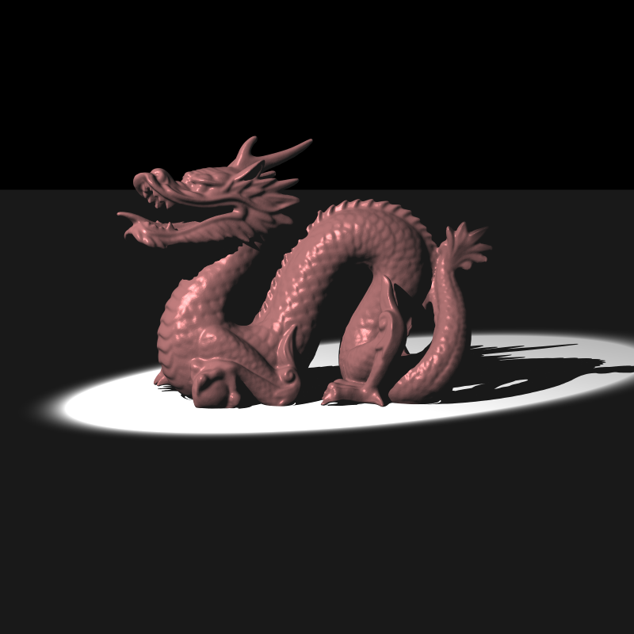


### 2.3 Environment Light
This is the most interesting light type because in this one the light is the environment it self. In this lighting we imagine a box that covers the entire scene and by sending rays to them we compute the color of the objects in the scene. For the sampling strategy we have used inversion sampling in order to give the appropriate probability to the sphere’s entire surface. We have two types of environment maps. Which are “latitude-longitude environment maps” and “spherical environment maps”. 

Here are the formulas for the converting world space to the image space:

* formula of “latitude-longitude environment maps”
  
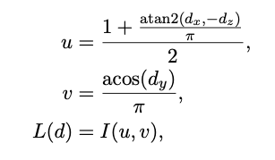

* formula of “spherical environment maps”
  
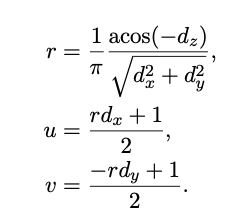

Here is the corresponding code snippet:
```cpp
Vec3r RayTracer::computeEnvironmentColor(Image tex_img, Vec3r d, std::string type) {
    real pi = 3.14159;
    real u,v;
    if (type == "latlong") {
        u = (1 + atan2(d.x, - d.z) / pi) * 0.5;
        v = acos(d.y) / pi;
    }
    else if (type == "probe") {
        real r = 1/pi * (acos(-d.z) / pow(d.x * d.x + d.y * d.y, 0.5));

        u = (r * d.x + 1) * 0.5;
        v = (-r * d.y + 1) * 0.5;
    }

    real tex_w = u * tex_img.width;
    real tex_h = v * tex_img.height;

    return applyBilinearInterpolation(tex_img.data, tex_img.width, tex_img.height, tex_img.channels, tex_w, tex_h);
}
```

In the sample outputs the results are maybe obtained by nearest interpolation but I decided to use bilinear interpolation to obtain better quality images.

Here are the results without objects in the scene:

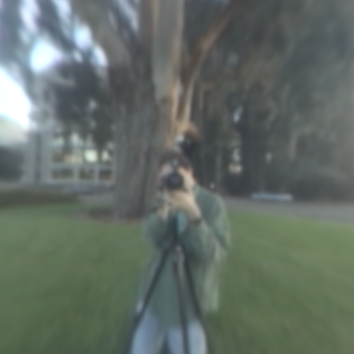

As we mentioned, we can also put objects into the scene and sample from the environment for compute the color of the objects. First we construct an orthonormal basis around the normal of the object.

For the uniform sampling we use this formula:

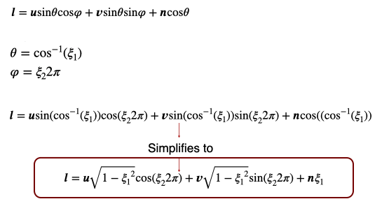

And for the cosine sampling we use this formula:

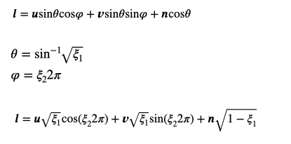

Here is the corresponding code snippet:

```cpp
if (material.getType() != "default") continue;
real psi_1 = getRandomFloat();
real psi_2 = getRandomFloat();

real pi = 3.14159;

Vec3r norm = hit_record.normal;
Vec3r u = computeOrthoBasis(norm);
Vec3r v = normalizeVec3r(crossVec3r(u, norm));

Vec3r l;
if (env_light.getSampler() == "uniform") {
    l = (pow(1 - psi_1 * psi_1, 0.5) * cos(psi_2 * 2 * pi)) * u +
        (pow(1 - psi_1 * psi_1, 0.5) * sin(psi_2 * 2 * pi)) * v +
        psi_1 * norm;

    Image tex_img = scene.texture.getImage(env_light.getImageID() - 1);
    Vec3r radiance = computeEnvironmentColor(tex_img, l, env_light.getType()) / (2 * pi);

    final_color = final_color + radiance;
}
else { // Cosine
    l = (pow(psi_1, 0.5) * cos(psi_2 * 2 * pi)) * u +
        (pow(psi_1, 0.5) * sin(psi_2 * 2 * pi)) * v +
        (pow(1 - psi_1, 0.5)) * norm;

    Image tex_img = scene.texture.getImage(env_light.getImageID() - 1);
    Vec3r radiance = computeEnvironmentColor(tex_img, l, env_light.getType()) * pi;

    final_color = final_color + radiance;
}
```

Here are the results:

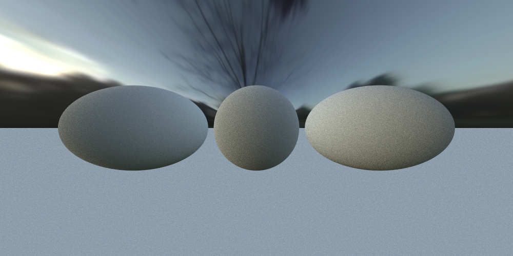


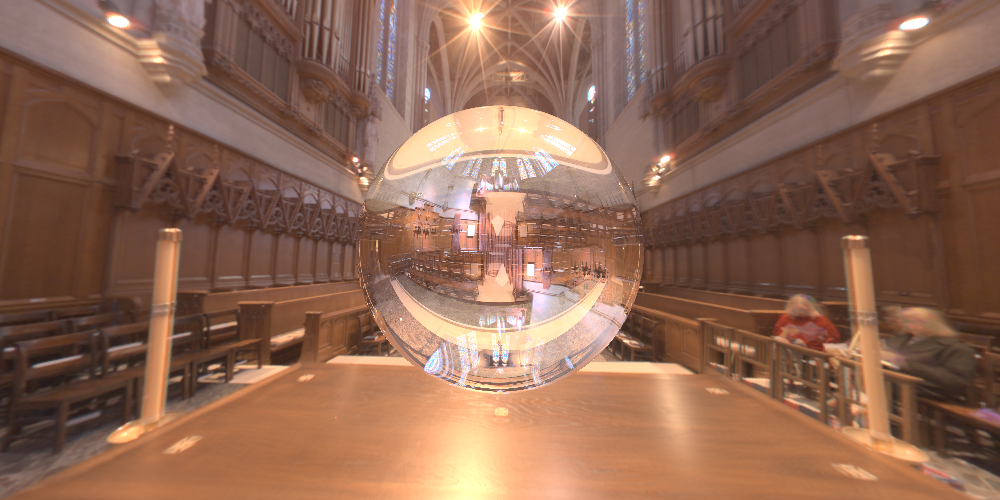

Also one needs to be careful about the reflective surfaces. For these surface types we shouldn’t sample the ray’s direction using inversion sampling instead we need to use the reflected ray’s directions.

## 3. Discussion

Overall it is fun to deal with these new features. In this homework we generate some artistic scenes with the spot lights. Although I think I correctly implemented the tone-mapping algorithms in some scenes my end results are not fully correct. I think it is maybe because of the some scenes are already gamma corrected. But in the hw text it is specified that apply gamma correction after tone-mapping so I stick with it. Thank you for reading my blog. If you have any questions feel free to ask them.
