# 6. Path Tracing & BRDFs
Hello everyone, welcome to my blog again. This will be the last episode of our ray-tracing journey. This blog is about BRDFs and path tracing. These concepts are really crucial in ray tracing, and most of the pioneer games are using path tracing to increase the authenticity of their game (eg: quake 2, cyberpunk 2077 etc). For now we only compute the light from the light sources. But, now we will integrate light objects to our scene to render more realistic scenes.

## 1. BRDFs
Bidirectional reflectance distribution functions describe the amount of light reflected from a surface for any given angle of arrival and departure.

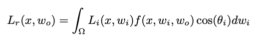

The f(x,wi,wo) is the brdf in this rendering equation. It tell how much of the light coming from the wi direction is reflected along the wo direction from point x. We calculate this integral across the whole hemisphere centered on the surface normal. Since our BRDFs are uniform and they don’t change based on location, we can also get rid of the x parameter. Diffuse components of all BRDFs are same except for a difference in normalization. Main difference between BRDFs are formulation of the specular component. In this blog we will talk about 5 different types of BRDF.

The below code represents the all the necessary computations for each formula. Since the formula of different BRDFs are very similar I store the necessary components like this

```cpp
real pi = 3.14159;
real cos_theta = dotVec3r(wi, norm);
if (cos_theta < 0) return Vec3r(0);

Vec3r wh = (wo + wi) / lengthSquared(wo + wi); 
Vec3r wi_r = normalizeVec3r(-wi + 2 * norm * cos_theta);

real cos_alpha_h = dotVec3r(wh, norm);
real cos_alpha_r = dotVec3r(wi_r, wo);
real p = brdf.exponent;

Vec3r kd = hit_record.kd;
Vec3r ks = hit_record.ks;
```

### 1.1 Phong BRDF

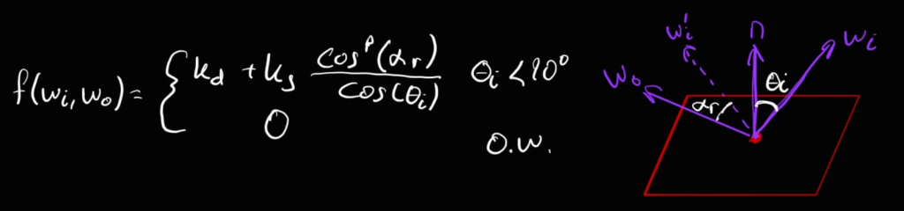

The general formula of Phong BRDF is like this. “p” term represent the phong exponent and it is given by the scene. It is impossible to normalize this BRDF so it is not energy conserving.

```cpp
else if (type == "OriginalPhong") {
    return kd + ks * pow(cos_alpha_r, p) / cos_theta;
}
```

### 1.2 Modified Phong BRDF

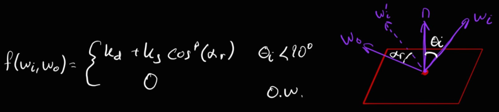

This is basically the Phong BRDF with cos(θi) removed from the denominator.

We can normalize this BRDF in order to make it energy conserving. Here is the end formula:

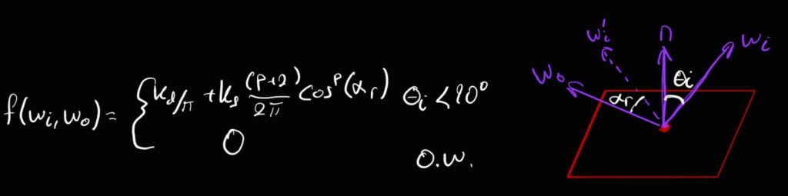

```cpp
else if (type == "ModifiedPhong") {
    if (brdf.normalized) {
        return kd * (1 / pi) + ks * (p + 2) / (2 * pi) * pow(cos_alpha_r, p);
    }
    else 
        return kd + ks * pow(cos_alpha_r, p);
}
```

### 1.3 Blinn-Phong BRDF

In this BRDF, we use the angle between the half vector and the surface normal instead of the wo and the perfect reflection direction.

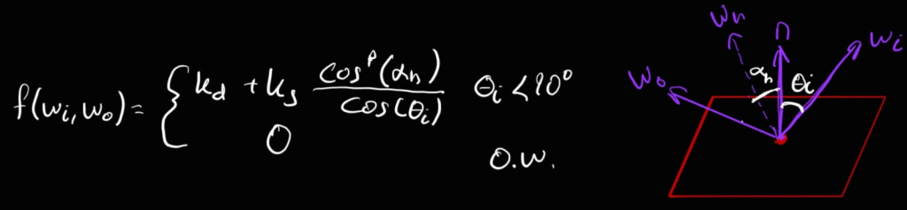

```cpp
if (type == "OriginalBlinnPhong" || type == "default" || type == "") {
    return kd + ks * (pow(cos_alpha_h, p) / cos_theta);
}
```

### 1.4 Modified Blinn-Phong BRDF

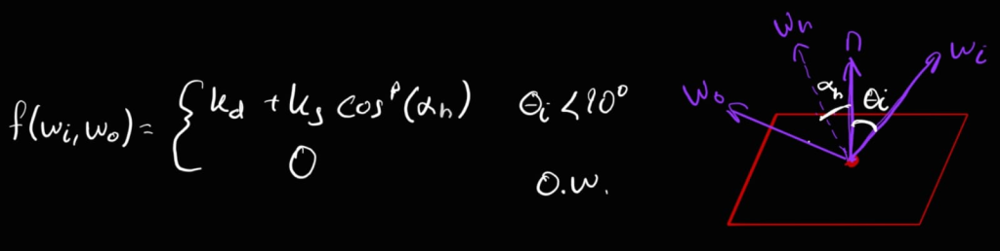

Again, we can normalize this BRDF in order to make it energy conserving.

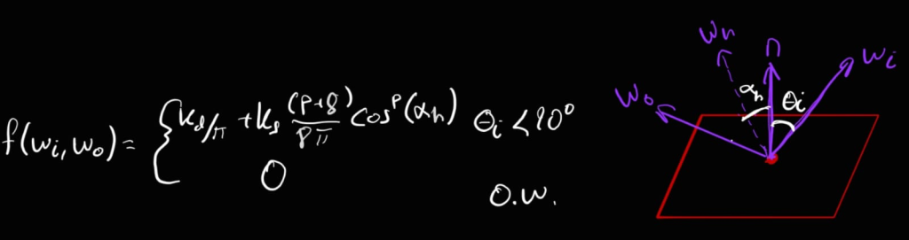

```cpp
else if (type == "ModifiedBlinnPhong") {
    if (brdf.normalized)
        return kd * (1 / pi) + ks * (p + 8) / (8 * pi) * pow(cos_alpha_h, p);
    else 
        return kd + ks * pow(cos_alpha_h, p);
}

```

### 1.5 Torrance-Sparrow BRDF

This model assumes the surface is actually a collection of tiny ‘micro-facets.’ To simulate reality, we track three distinct properties:

* **The F Term:** Calculates the mirror-like Fresnel reflection for each individual facet.
* **The D Term (Distribution):** Defines the orientation of the facets—how many are pointing toward the surface normal versus pointing away.
* **The G Term (Geometry):** Accounts for the self-shadowing and masking that happens when these tiny facets block one another.

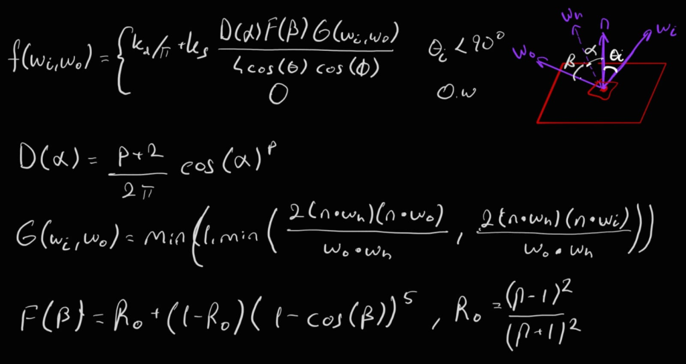

```cpp
else if (type == "TorranceSparrow") {
    real D = (p + 2) / (2 * pi) * pow(cos_alpha_h, p);
    real n_wh = dotVec3r(norm, wh);
    real n_wo = dotVec3r(norm, wo);
    real wo_wh = dotVec3r(wo, wh);
    real n_wi = dotVec3r(norm, wi);
    real G1 = 2 * n_wh * n_wo / wo_wh;
    real G2 = 2 * n_wh * n_wi / wo_wh;
    real G = std::min(1.0, std::min(G1, G2));
    real n = mat.getRefractionIndex();
    real R_0 = pow(n - 1, 2) / pow(n + 1, 2);
    real F = R_0 + (1 - R_0) * pow(1 - wo_wh, 5);
    Vec3r result;
    if (brdf.kd_fresnel) {
        return (1-F) * kd / pi + ks * (D * F * G) / (4 * n_wi * n_wo);
    }
    else {
        return kd / pi + ks * (D * F * G) / (4 * n_wi * n_wo);
    }
}
```

After implementing all these BRDFs now it is time to update our shading logic. Here is the final code of the integration of BRDFs to the light sources:

```cpp
for (const auto& point_light : scene.point_lights) {
    Vec3r light_direction = point_light.getLightDirection(hit_record.intersection_point);
    real light_distance = point_light.getLightDistance(light_direction);
    if (!inShadow(hit_record, point_light, light_direction, light_distance)) {
        if (scene.BRDFs.size() > 0) {
            Vec3r L_i = point_light.getIntensity() / pow(light_distance, 2);
            Vec3r wi = normalizeVec3r(light_direction);
            Vec3r wo = -ray.direction;
            BRDF brdf = scene.BRDFs[material.getBRDFID() - 1];
            brdf.refractive_index = ray.n;
            Vec3r fr = computeBRDF(brdf, hit_record.normal, wi, wo, material, hit_record); 
            real cos_theta = dotVec3r(wi, hit_record.normal);
            final_color = final_color + L_i * fr * cos_theta;
        }
        else {
            final_color = final_color + diffuseTerm(hit_record, point_light) + specularTerm(hit_record, point_light, ray);
        }
    }
}
```

And here are the final results:

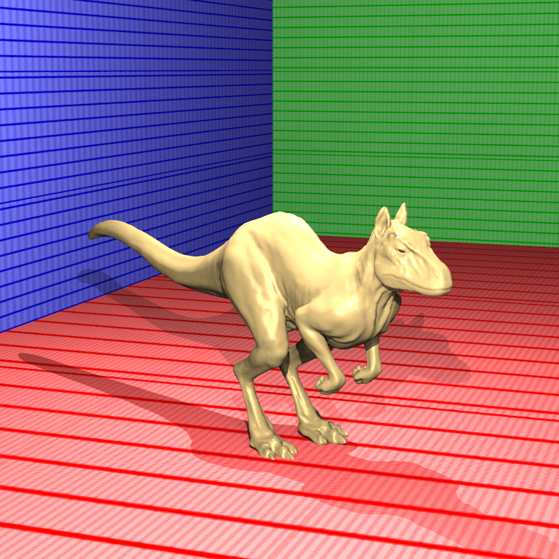

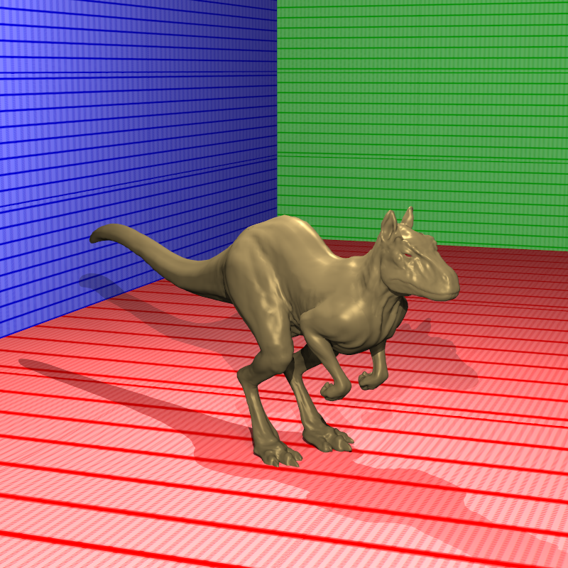

## 2. Light Objects
From now, we have only light sources. But in real life we are surrounded by objects that generates light such as lamp, candle etc. So to make our ray-tracer more realistic we need light objects. We have two types of light objects which are LightSphere and LightMesh.

Here are the scene definitions of them:

```cpp
"LightSphere": {
  "_id": "1",
  "Material": "1",
  "Center": "11",
  "Radius": "0.2",
  "Radiance": "31.831 31.831 31.831"
},
"LightMesh": {
  "_id": "1",
  "Material": "1",
  "Radiance": "1.21 1.21 1.21",
  "Faces": {
    "_data": "2 6 7 7 3 2",
    "_vertexOffset": "1"
  }
```

The only difference from the non-light objects is that we have radiance values.

### 2.1 Light Sphere
Since we are dealing with a sphere surface we need to decide at what point we should sample. To do this, we will apply cosine sampling to the seeable hemisphere of the light sphere. The cosine sampling details can be reached from the episode 5 of our ray tracing blogs. After deciding the point on the light we apply BRDF to the intersected object with this light direction.

Here is the full code of this process:

```cpp
for (const auto& lSphere : scene.light_spheres) {
    real psi_1 = getRandomFloat();
    real psi_2 = getRandomFloat();
    Vec3r center = scene.vertex_data[lSphere.getCenterVertexID() - 1];
    Vec3r hit_local = applyTransformToPoint(lSphere.getInverseTransformation(), hit_record.intersection_point);
    Vec3r n = normalizeVec3r(hit_local - center);
    Vec3r u = computeOrthoBasis(n);
    v = normalizeVec3r(crossVec3r(u, n));
    real sin_theta = std::sqrt(1.0f - psi_1 * psi_1);
    real cos_theta = psi_1; 
    real phi = 2.0f * M_PI * psi_2;
    Vec3r l = u * (sin_theta * std::cos(phi)) + 
                v * (sin_theta * std::sin(phi)) + 
                n * cos_theta;
    Vec3r light_point = center + (l * lSphere.getRadius());
    light_point = applyTransformToPoint(lSphere.getTransformation(), light_point);
    Vec3r light_vec = light_point - hit_record.intersection_point;
    real dist_sq = dotVec3r(light_vec, light_vec); 
    real dist = std::sqrt(dist_sq); 
    Vec3r wi = light_vec / dist;
    PointLight pl;
    if (!inShadow(hit_record, pl, wi, dist)) {
        real cos_theta = std::max(0.0, dotVec3r(hit_record.normal, wi));
        Vec3r wo = -ray.direction;
        BRDF brdf = scene.BRDFs[material.getBRDFID() - 1];
        Vec3r fr = computeBRDF(brdf, hit_record.normal, wi, wo, material, hit_record);
        Vec3r Li = lSphere.getRadiance() / dist_sq;
        final_color = final_color + Li * fr * cos_theta;
    }
}
```

Here are the end results:

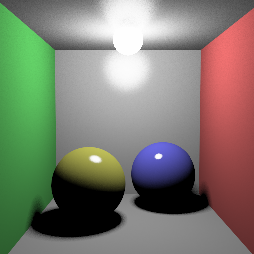

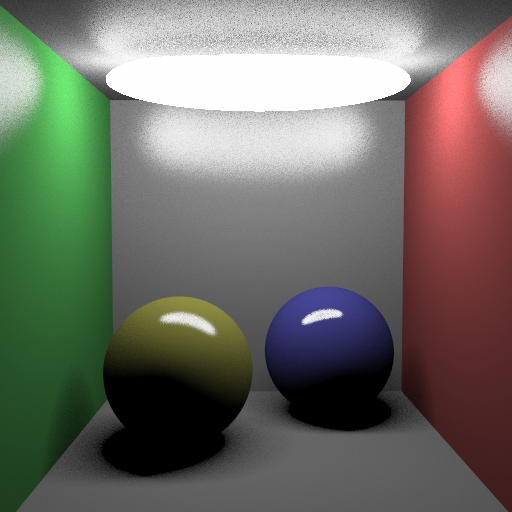

### 2.2 Light Mesh
The process is similar for light meshes too. We need to sample a point on the surface of the mesh. The correct way of doing this is giving weight to the triangles of the meshes by their surface areas. However, if we do this we need to divide the end result by the pdf. Since I couldn’t compute the pdf I apply a random sampling instead of importance sampling. Which is wrong but I think still acceptable way (giving same weight to all the triangles of the mesh) to do this.

Here is the full code of the light meshes:

```cpp
for (auto& lMesh : scene.light_meshes) {
    int num_faces = lMesh.getTriangles().size();
    int random_idx = (int)(getRandomFloat() * num_faces);
    if (random_idx >= num_faces) random_idx = num_faces - 1;
    const auto& tri = lMesh.getTriangles()[random_idx];
    real area = tri.getArea();
    Vec3r v0 = scene.vertex_data[tri.getV0ID() - 1];
    Vec3r v1 = scene.vertex_data[tri.getV1ID() - 1];
    Vec3r v2 = scene.vertex_data[tri.getV2ID() - 1];
    Vec3r edge1 = v1 - v0;
    Vec3r edge2 = v2 - v0;
    Vec3r local_normal = normalizeVec3r(crossVec3r(edge1, edge2));
    Vec3r light_normal_world = normalizeVec3r(applyTransformToVector(lMesh.getInverseTransformation(), local_normal));
    
    real tri_area = 0.5f * lengthSquared(crossVec3r(edge1, edge2));
    real psi_1 = getRandomFloat();
    real psi_2 = getRandomFloat();
    real sqrt_psi1 = std::sqrt(psi_1);
    real u = 1.0f - sqrt_psi1;
    real v = sqrt_psi1 * (1.0f - psi_2);
    real w = sqrt_psi1 * psi_2;
    Vec3r light_point_local = v0 * u + v1 * v + v2 * w;
    Vec3r light_point_world = applyTransformToPoint(lMesh.getTransformation(), light_point_local);
    Vec3r light_vec = light_point_world - hit_record.intersection_point;
    if (dotVec3r(light_vec, light_normal_world) >= 0.0f) {
        continue; 
    }
    real dist_sq = dotVec3r(light_vec, light_vec);
    real dist = std::sqrt(dist_sq);
    Vec3r wi = light_vec / dist;
    PointLight pl;
    if (!inShadow(hit_record, pl, wi, dist)) {
        real cos_theta = std::max(0.0, dotVec3r(hit_record.normal, wi));
        
        real cos_light = dotVec3r(-wi, light_normal_world); 
        Vec3r wo = -ray.direction;
        BRDF brdf = scene.BRDFs[material.getBRDFID() - 1];
        Vec3r fr = computeBRDF(brdf, hit_record.normal, wi, wo, material, hit_record);
        Vec3r Li = lMesh.getRadiance() / dist_sq;
        real weight = area * num_faces;
        final_color = final_color + Li * fr * cos_theta;
    }
}
```

Here are the end results:


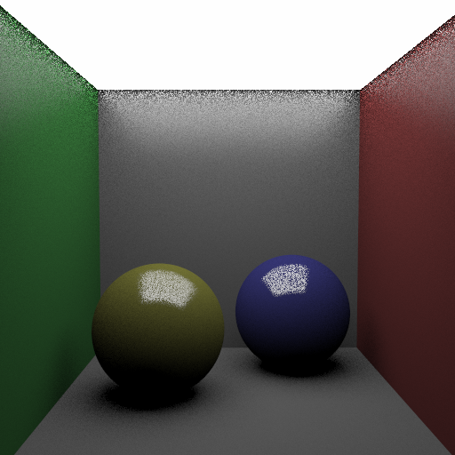

I need to also mentioned that if we hit the light objects we directly return the radiance value of the object like this:

```cpp
if (hit_record.lightObject == true) return hit_record.object_radiance * 255;
```

## 3. Path Tracing
For now, all of our lighting is direct lighting. However in real life all objects are reflecting some amount of light which helps to see the objects that are not directly visible from the light’s perspective. To integrate this feature to our ray tracer, we need to implement path tracing.

To do this we need to first understand the Monte Carlo integration. Which is a numerical method that  that can be used to estimate the value of an integral by averaging multiple samples.

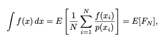

where f is the function that needs to be integrated, xi are random variables, p is a probability density function for the random variables, N is the number of samples, and E denotes the expected value.

Let’s break down the variables in this equation:

* **f:** The function we are trying to integrate.
* **xi​:** The random variables (or samples) we use.
* **p:** The probability density function that tells us how likely each sample is.
* **N:** The total number of samples we take.
* **E:** The Expected Value

In the context of path tracing, the following specific formula can be used:

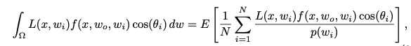

To integrate this formula to our ray-tracer we need to change the full logic of the “applyShading()” function. So I defined a separate function named “pathTracing()”. There are several methods in path tracing for ray generation but for this homework I only implemented the uniform random sampling. However in the future when I have a time, I want to implement the other methods to reduce the noise in the final results, such as Stratified Uniform Random Sampling, Importance Sampling, Next Event Estimation (NEE), Multiple Importance Sampling (MIS), Russian Roulette, Clamping.

### 3.1 Uniform Random Sampling
I already mentioned this method in my previous blog, so I will not go into details. Our aim is to generate a random ray from the surface and compute the incoming luminance. In the formula we shared above L(x,wi) corresponds to this process. For the mirror, dielectric and conductor objects we are not generating a new ray but use the reflected ray. 

The code for this objects is like this:

```cpp
Vec3r L_e = hit_record.object_radiance;
if (material.isMirror() || material.isConductor()) {
    Ray reflection_ray = reflect(ray, hit_record);
    Vec3r L_i = computeColor(reflection_ray);
    Vec3r reflectance = material.getMirrorReflectance();
    if (material.isConductor()) {
        reflectance = reflectance * computeFresnelConductor(ray, hit_record);
    }
    return (L_e + L_i * reflectance) * attenuation;
}
else if (material.isDielectric()) {
    real n1 = is_entering ? 1.0f : ray.n;
    real n2 = is_entering ? material.getRefractionIndex() : 1.0f;
    real R = computeFresnelDielectric(ray, hit_record, n1, n2);
    if (getRandomFloat() < R) {
        Ray reflection_ray = reflect(ray, hit_record);
        return (L_e + computeColor(reflection_ray) * material.getMirrorReflectance()) * attenuation;
    } 
    else {
        Ray refraction_ray = refract(ray, hit_record, n1, n2);
        return (L_e + computeColor(refraction_ray)) * attenuation;
    }
}
```
For the default objects we apply the formula above directly like this:

```cpp
else {
    real psi_1 = getRandomFloat();
    real psi_2 = getRandomFloat();
    real pi = 3.14159;
    Vec3r norm = hit_record.normal;
    Vec3r u = computeOrthoBasis(norm);
    Vec3r v = normalizeVec3r(crossVec3r(u, norm));
    Vec3r wi;
    wi = (pow(1 - psi_1 * psi_1, 0.5) * cos(psi_2 * 2 * pi)) * u +
            (pow(1 - psi_1 * psi_1, 0.5) * sin(psi_2 * 2 * pi)) * v +
            psi_1 * norm;
    wi = normalizeVec3r(wi);
    float pdf = 1.0f / (2.0f * M_PI);
    if (dotVec3r(wi, norm) < 0) wi = -wi;
    Ray random_ray = reflect(ray, hit_record);
    random_ray.direction = wi;
    Vec3r L_i = computeColor(random_ray);
    Vec3r wo = -ray.direction;
    BRDF brdf = scene.BRDFs[material.getBRDFID() - 1];
    brdf.refractive_index = ray.n;
    Vec3r fr = computeBRDF(brdf, norm, wi, wo, material, hit_record);
    float cos_theta = std::max(0.0, dotVec3r(hit_record.normal, wi));
    Vec3r color = L_e + (L_i * fr * cos_theta) / pdf;
    return color;
}
```

And here are the nosiest end results since we only have uniform sampling and 100spp!!

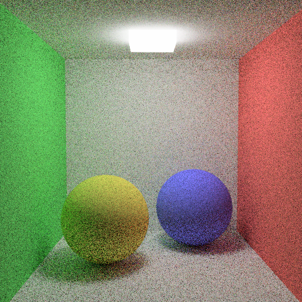

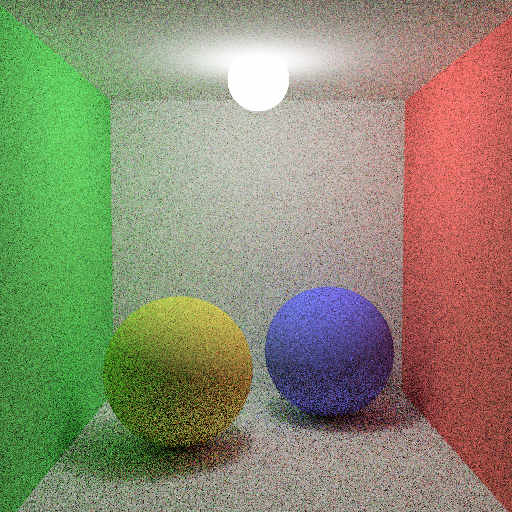

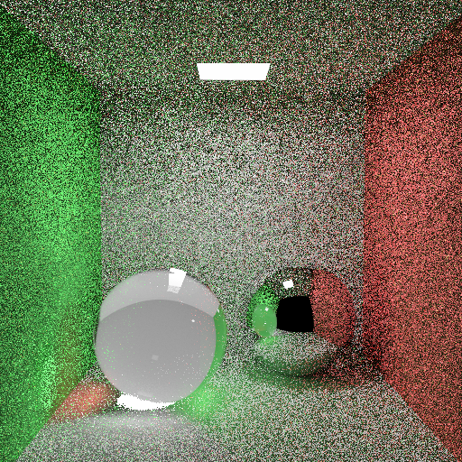

# 4. Conclusion
When one only check the final path tracer code that I shared, think that “Oh it is easy to implement path tracer”, but the reality is much more different than the final code.

We start with rendering the scenes with different type of objects. Then implemented an acceleration structure to render scenes much faster. After doing that we introduced multi sampling to prevent anti-aliasing and add effects like motion blur and depth of field. After that we implement texture mapping to make our objects more realistic. Then we integrate more advanced lighting techniques such as environment lighting. And finally we implement BRDFs and light objects to render scenes with using path tracer.

Overall, it is a fun process to deal with. But after sharing my term-project, I think I will give a little break to my ray-tracing journey because I am really tired of fixing the bugs. I want to thank to Prof. Dr. Ahmet Oğuz Akyüz to give me the opportunity to take his graduate course. This process not only help me to understand the ray-tracing deeply but also improve my coding skills a lot. So this is all I want to say. See you guys in my next blog which is about comparison of different acceleration structures.


